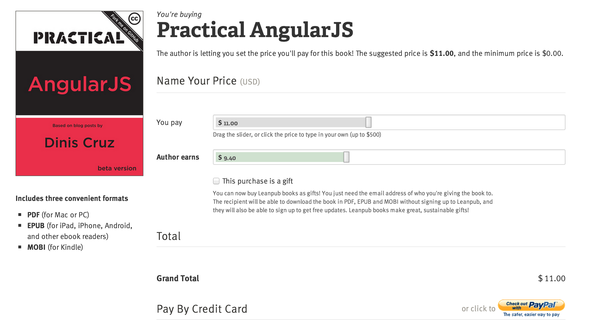

Book Practical AngularJS
========================

This is the source repository for the [Practical AngularJS](https://leanpub.com/Practical_AngularJS) book published at LeanPub

The book is still under development, so if you spot any issues or have recommendations please [fork this repository](https://github.com/DinisCruz/Book_Practical_AngularJS/fork) and submit a [Pull Request](https://github.com/DinisCruz/Book_Practical_AngularJS/pulls) :)

## Issues and Discussion group

If you have questions please create a new [Issue here at gitHub](https://github.com/DinisCruz/Book_Practical_AngularJS/issues) or use the [Leanpub Discussion page for this book](https://leanpub.com/Practical_AngularJS/feedback)

## Buy eBook 

If you can, please buy the book since it will help with production, design, editing and layout costs.

Leanpub provide a nice shooping card solution which allows you to chose which price to pay: [Buy Practical AngularJS book](https://leanpub.com/Practical_AngularJS/packages/book/purchases/new)

