### Maturity Models - Features

Here are the current feature set of the application

**Home page**

**Projects**

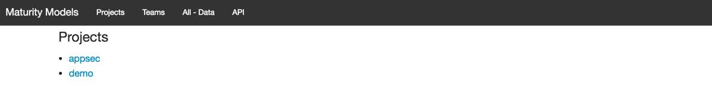

**Teams**

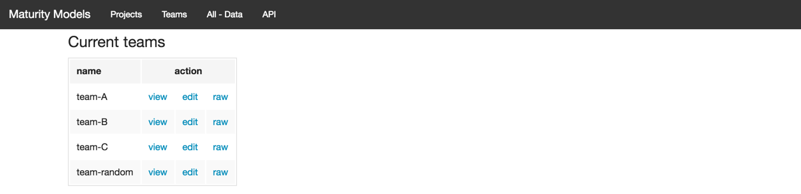

**Team A - View**

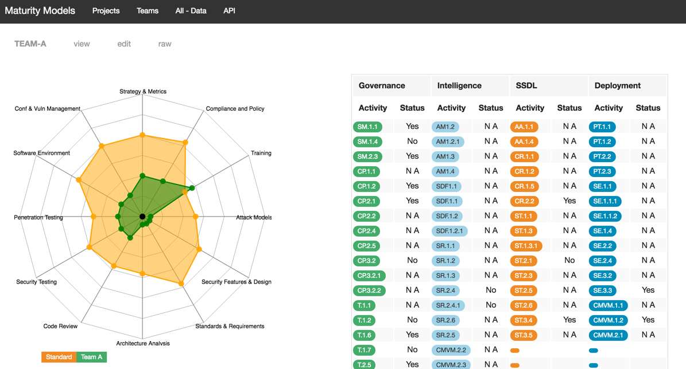

**Team A - Edit**

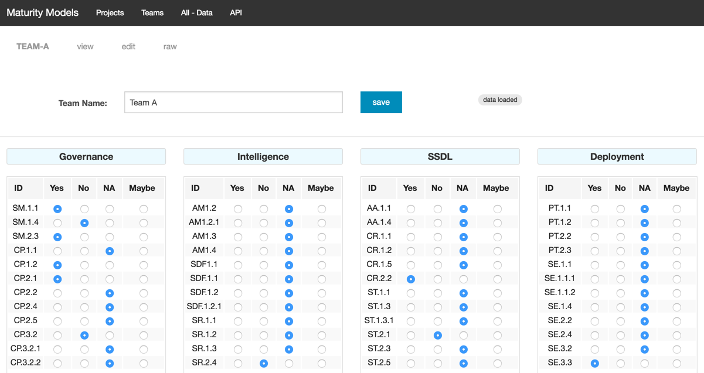

**Team A - Raw**

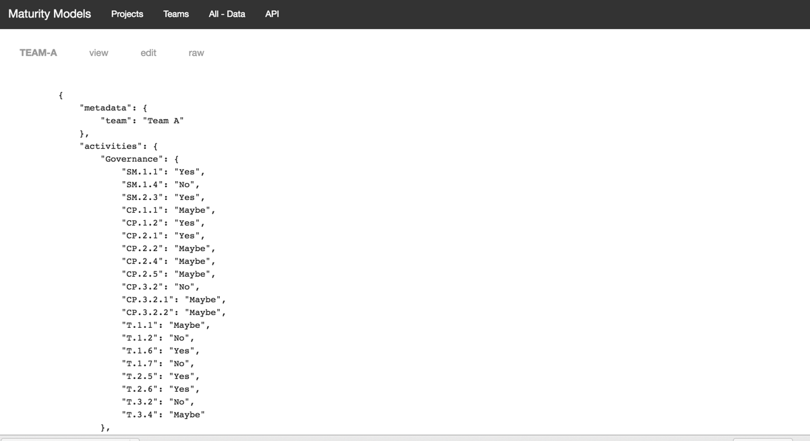

**All Data**

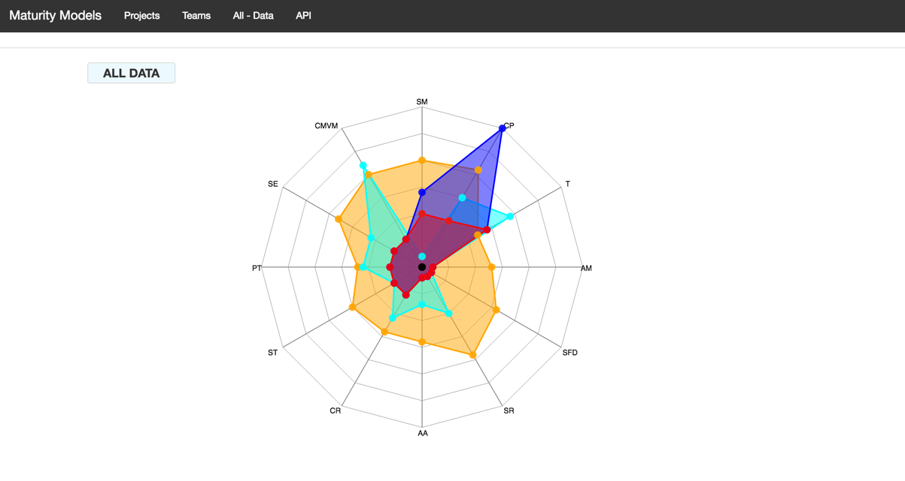

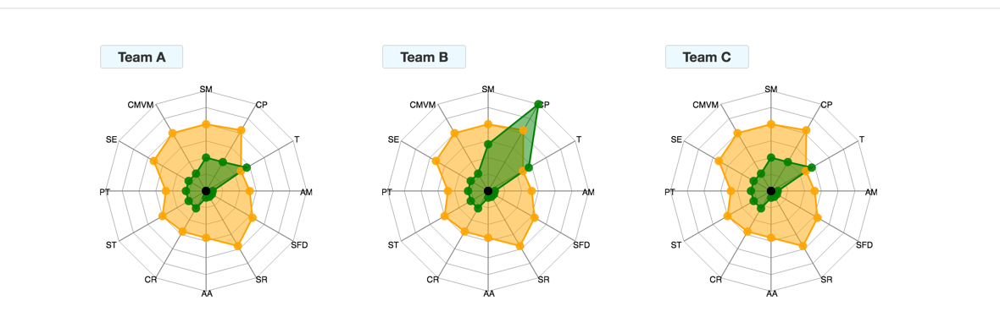

**API**

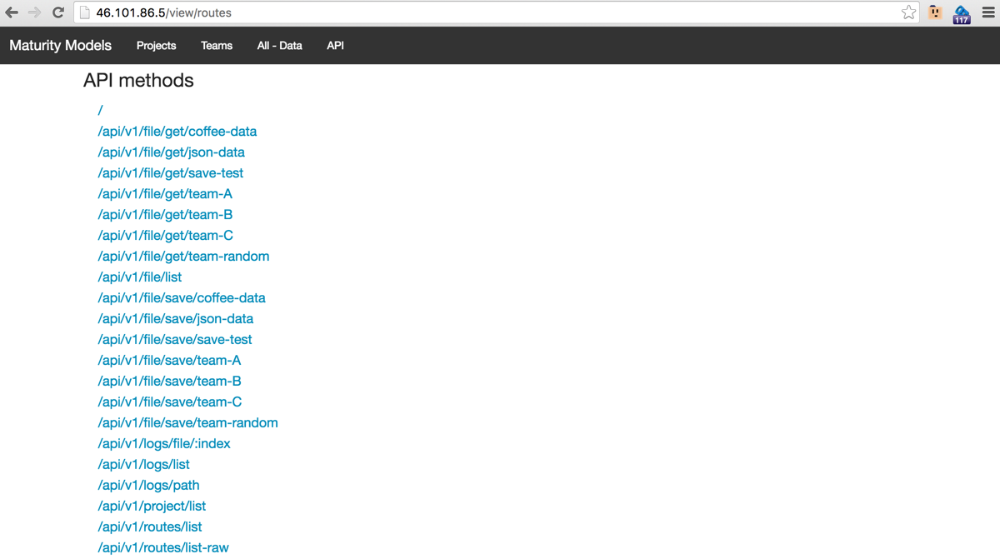

**API - /file/get/team-A**

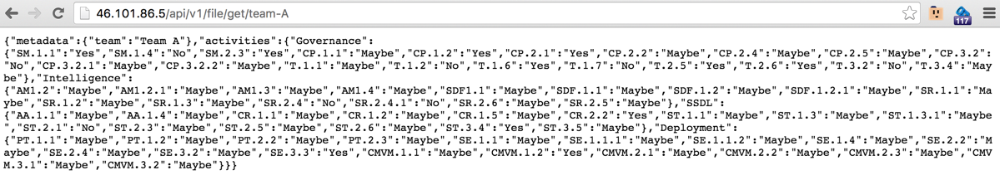

**API - /file/get/team-A?pretty**

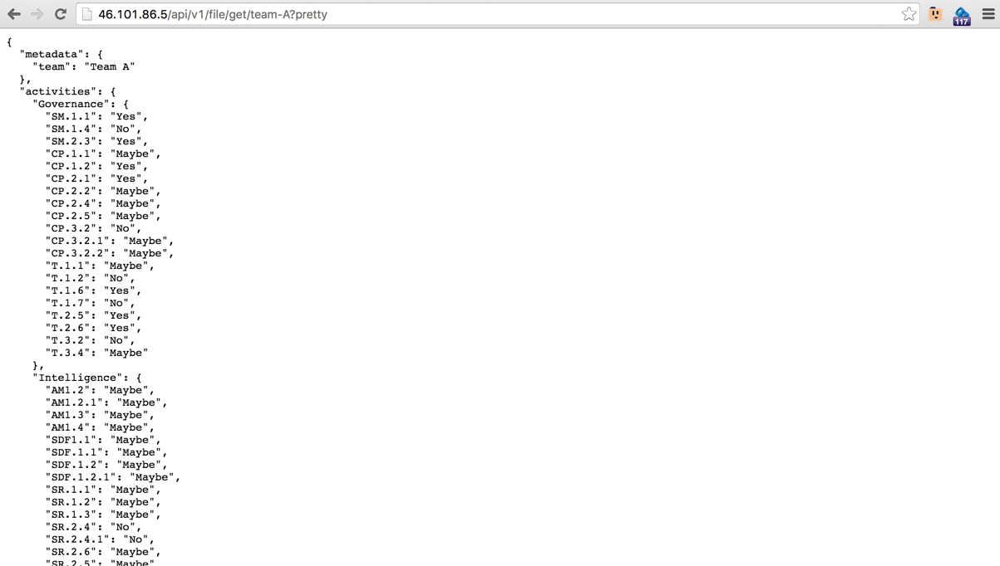

**API - routes/list-raw**

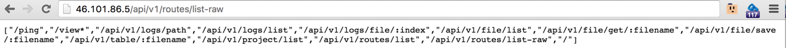

**API - routes/list**

