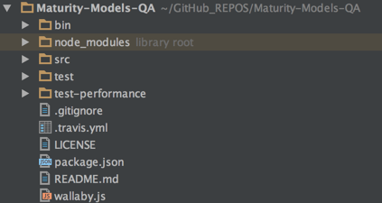
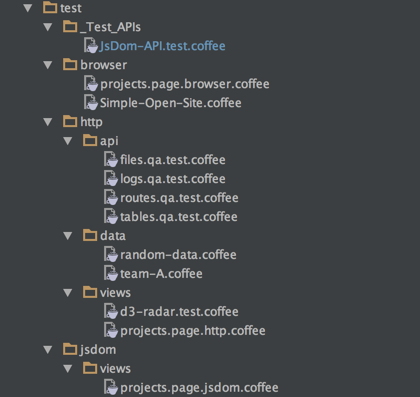
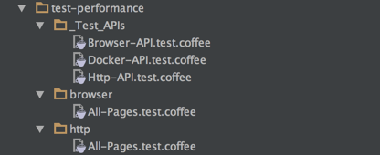

### Code - QA

This is the site with the QA tests.

These are tests designed to be executed on a live version of the site , either at localhost (while dev), or pre-prod (current using DigitalOcean)


Browser automation is done using [Electrium](https://github.com/o2platform/electrium)

**/**




**/src**


**/test**



**/test-performance**




**.travis.yml**

Need to add display so that the browser automation works ok

```yml
language: node_js

node_js:
  - "5"

before_script:
  - "export DISPLAY=:99.0"
  - "sh -e /etc/init.d/xvfb start"
#  - sleep 3
```

**package.json**

```json
{
  "name": "bsimm-graphs-qa",
  "version": "0.0.1",
  "description": "",
  "main": "index.js",
  "scripts": {
    "test": "mocha --compilers coffee:coffee-script/register -- recursive test"
  },
  "author": "Dinis Cruz",
  "license": "ISC",
  "dependencies": {
    "cheerio": "^0.20.0",
    "electrium": "0.0.7",
    "fluentnode": "^0.6.1",
    "mocha": "^2.5.2"
  },
  "devDependencies": {
    "async": "^1.5.2",
    "jsdom": "^9.2.1"
  }
}
```

**wallaby.js**

This is the only wallaby file that I don't execute all tests at the same time (with browser/network automation it is very easy to create long running and performance intensive tests)

```js
module.exports = function ( ) {
    return {
        files: [
            { pattern: 'src/**/*.coffee'}
        ],

        tests: [
            //'test/**/*.coffee'
            'test/jsdom/**/*.coffee'
            //'test/http/**/*.coffee'
        ],

        testFramework: 'mocha',

        env: {
            type: 'node'
        },
        workers: {
            recycle: true
        }
    };
};
```
