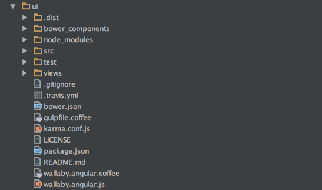
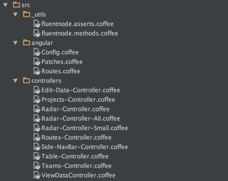
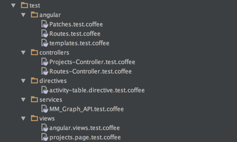
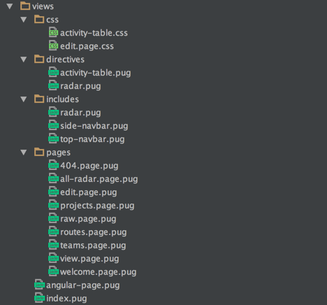

### Code - UI - Angular

This is the submodule probject that contains the AngularJS based UI

There are no server side generate pages

**/**



**/src**



**/test**



**/views**




**.travis.yml**

```yml
language: node_js

node_js:
  - "5"

before_script:

  - npm install -g bower
  - bower install
  - npm install -g gulp
  - gulp
  - ls -la
```  

**bower.json**

```json
{
  "name": "maturity-models-ui",
  "description": "Maturity Models UI",
  "main": "index.js",
  "authors": [
    "Dinis Cruz"
  ],
  "license": "ISC",
  "homepage": "https://github.com/DinisCruz/Maturity-Models-UI",
  "moduleType": [],
  "dependencies": {
    "d3": "~3.5.16",
    "radar-chart-d3": "~1.2.1",
    "foundation": "^5.5.3",
    "angular": "^1.5.6",
    "angular-mocks": "^1.5.6",
    "chai": "^3.5.0",
    "angular-route": "^1.5.6"
  }
}
```

**gulpfile.coffee**

```coffee
gulp          = require 'gulp'
coffee        = require 'gulp-coffee'
concat        = require 'gulp-concat'
pug           = require 'gulp-pug'
plumber       = require 'gulp-plumber'
templateCache = require('gulp-angular-templatecache');


source_Files  = './src/**/*.coffee'
pug_Files     = './views/**/*.pug'
css_Files     = './views/css/**/*.css'

html_Folder   = './.dist/html'
js_Folder     = './.dist/js'
css_Folder    = './.dist/css'

gulp.task 'compile-pug', ()->
  gulp.src pug_Files
      .pipe plumber()
      .pipe pug()
      .pipe gulp.dest html_Folder

gulp.task 'compile-coffee', ()->
  gulp.src(source_Files)
      .pipe plumber()
      .pipe coffee {bare: true}
      .pipe concat js_Folder + '/angular-src.js'
      .pipe gulp.dest '.'

gulp.task 'templateCache', ['compile-pug'], ()->
  gulp.src html_Folder + '/**/*.html'
      .pipe templateCache( module: 'MM_Graph' )
      .pipe gulp.dest js_Folder

gulp.task 'concat-css', ()->
  gulp.src(css_Files)
      .pipe concat css_Folder + '/app.css'
      .pipe gulp.dest '.'

gulp.task 'watch', ['compile-coffee', 'compile-pug', 'templateCache', 'concat-css'], ()->
  gulp.watch source_Files, ['compile-coffee']
  gulp.watch pug_Files   , ['compile-pug', 'templateCache']
  gulp.watch css_Files   , ['concat-css']

gulp.task 'default', ['compile-coffee','compile-pug', 'templateCache', 'concat-css'], ()->
```

**karma.config.js**

```js
module.exports = function(config) {
    config.set({
        basePath: '',
        frameworks: ['mocha'],

        files: [
            'bower_components/angular/angular.js',
            'bower_components/angular-route/angular-route.js',
            'bower_components/angular-mocks/angular-mocks.js',
            'bower_components/jquery/dist/jquery.min.js',
            'node_modules/chai/chai.js',

            '.dist/js/angular-src.js',
            '.dist/js/templates.js',

            'test/**/*.coffee'
        ],
        exclude       : [ ],
        preprocessors : {
            'test/**/*.coffee': ['coffee'],
        },
        reporters     : ['progress'],
        port          : 9876,
        colors        : true,
        logLevel      : config.LOG_INFO,
        autoWatch     : true,
        browsers      : ['PhantomJS'],
        singleRun     : true
    })
};
```

**package.json**

```json
{
  "name": "maturity-models-ui",
  "version": "0.0.1",
  "description": "AngularJs UI for Node application to help managing Maturity Models",
  "main": "index.js",
  "directories": {
    "test": "test"
  },
  "scripts": {
    "test": "node_modules/.bin/karma start karma.conf.js"
  },
  "repository": {
    "type": "git",
    "url": "git+https://github.com/DinisCruz/Maturity-Models-UI.git"
  },
  "author": "DinisCruz",
  "license": "ISC",
  "bugs": {
    "url": "https://github.com/DinisCruz/Maturity-Models-UI/issues"
  },
  "homepage": "https://github.com/DinisCruz/Maturity-Models-UI#readme",
  "devDependencies": {
    "chai": "^3.5.0",
    "coffee-script": "^1.10.0",
    "gulp": "^3.9.1",
    "gulp-angular-templatecache": "^1.8.0",
    "gulp-coffee": "^2.3.2",
    "gulp-plumber": "^1.1.0",
    "gulp-pug": "^3.0.3",
    "karma": "^0.13.22",
    "karma-coffee-preprocessor": "^1.0.0",
    "karma-mocha": "^1.0.1",
    "karma-phantomjs-launcher": "^1.0.0",
    "mocha": "^2.5.3",
    "phantomjs": "^2.1.7",
    "phantomjs-prebuilt": "^2.1.7",
    "supertest": "^1.2.0"
  }
}
```


**wallaby.coffee**

```coffee
module.exports = (wallaby)->
  #console.log wallaby

  just_Load = (file)->
    return { pattern: file, instrument: false, load: true, ignore: false }
  config =
    files : [
      just_Load 'bower_components/angular/angular.js'
      just_Load 'bower_components/angular-route/angular-route.js'
      just_Load 'bower_components/angular-mocks/angular-mocks.js'

      just_Load 'bower_components/jquery/dist/jquery.min.js'

      # weird bug where chai will load from node_modules but not from bower_components
      #{pattern: 'bower_components/chai/chai.js', instrument: true},
      just_Load  'node_modules/chai/chai.js'

      './src/**/*.coffee'
      './.dist/js/templates.js'

    ]
    tests : [
      './test/**/*.coffee'
    ]

    bootstrap:  ()->
      window.expect = chai.expect;

  testFramework: 'mocha'

  return config
```

**wallaby.js**

```js
require('coffee-script/register')

module.exports = require('./wallaby.angular.coffee')
```
