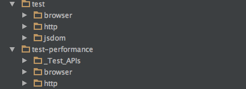
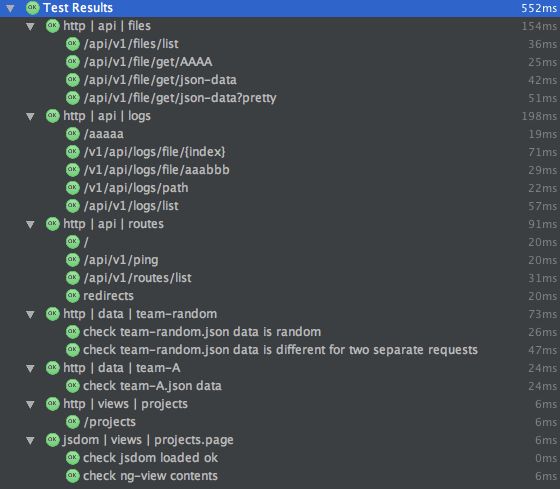
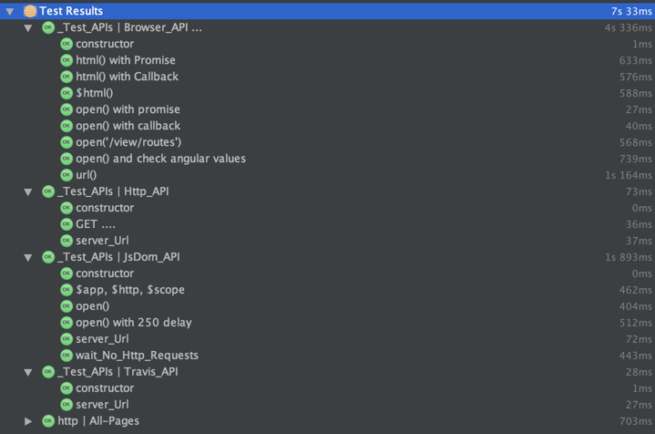

### Tests - QA

The QA tests are split into two areas **test** and **test-performance**

At the moment the main difference is that the **test-performance** contains:
 - tests that take long to run
 - tests that test the QA test APIs (Http-API, JsDom-API and Browser_API)

The idea is that the **test** should run quickly (i.e. sub second) which excludes any test that is stable but takes longer. This also makes the **test** tests _wallabyjs_ friendly (i.e. I can run those tests and get real-time feedback).

Here is the **test** execution (in 552ms):

Here is the **test-performance** execution (in 7s 33ms):

