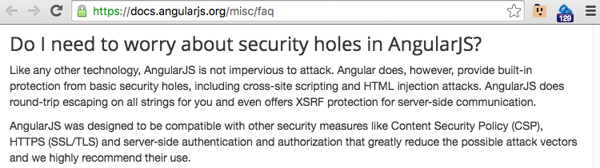

### AngularJS Security

_"Angular is pretty safe already, but if not used correctly with secure  best practices, will still lead to insecure software"_ [^angular-quote]

AngularJS as a client side framework, does not suffer from the same type of vulnerabilities that we usually see on web apps. By design, all assets are already on the client (i.e. the AngularJS app) and the attacker has full control over its execution environment (i.e. the browser).

In fact if you see too many Authorization decisions on the Angular code, then that is usually an indication that the server side is not enforcing those roles. A key concept is that **_Client side validation, authentication and authorization are 'usability features', not 'security features'_**

The main security issue that needs to handled at the AngularJS layer is XSS ([Cross-Site-Scripting](https://www.owasp.org/index.php/Cross-site_Scripting_(XSS))), which is created by the insecure creation of HTML.

AngularJS provides a lot of protections by default (specially when compared with other client side frameworks), but that doesn't mean that it it not possible to create XSS (i.e. Javascript execution). For example I've seen plenty of XSS created by direct DOM manipulation (usually in directives or jQuery-like coding).

Here are the patterns I like to following when coding AngularJS Apps:

- [know the attack surface](x.Pattern-known-the-attack-surface.md)
- [don't care about security](x.Pattern-dont-care-about-security.md)
- [don't use jquery](x.Pattern-dont-use-jquery.md)
- [don't use strings](x.Pattern-dont-use-strings.md)
- [validate all input](x.Pattern-validate-all-input.md)
- [don't use html method.md](x.Pattern-dont-use-html-method.md)

For me the key for AppSec is Assurance and that can only be done when we are able to [Answer Security questions with (unit) Tests](Answer Security questions with tests)

Here is what AngularJS says about [Security](https://docs.angularjs.org/misc/faq):

[^angular-quote]: Katy Anton, on email

#### Online resources

  - **Presentations**    
    - [An Abusive Relationship with AngularJS](http://www.slideshare.net/x00mario/an-abusive-relationship-with-angularjs), Dec 12, 2015 , Mario Heiderich,
    - [ng-owasp: OWASP Top 10 for AngularJS Applications](http://www.slideshare.net/kevinhakanson/ng-owasp-ndc?qid=32cb7bc9-0c19-43bd-b225-a55dfcfb038) , Jun 19, 2015, Kevin Hakanson
    - [Securing your AngularJS Application](http://www.slideshare.net/PhilippeDeRyck/securing-your-angularjs-application), Mar 17, 2016, Philippe De Ryck
    - [AngularJS Security: defend your Single Page Application](http://www.slideshare.net/carlo.bonamico/angularjs-security-defend-your-single-page-application), Oct 22, 2015, Carlo Bonamico
    - [Secure AngularJS](https://docs.google.com/presentation/d/1347saovLLeQ9y-WRElKXg26fHNGnbrUFhft_2m4rOwc/edit#slide=id.p), 5 Dec 13, Asaf David, @asafdav

  - **Videos**
    - [Security with Angular JS](https://www.youtube.com/watch?v=18ifoT-Id54), 27 May 13, David Mosher
    - [An Abusive Relationship with AngularJS](https://vimeo.com/165951806), Mario Heiderich, btconfDUS 2016  

  - **Security Research**
      - [mustache-security - AngularJS.wiki](https://code.google.com/archive/p/mustache-security/wikis/AngularJS.wiki)

  - **Articles** (note that these are done for 'usability')
    - [Techniques for authentication in AngularJS applications](https://medium.com/opinionated-angularjs/techniques-for-authentication-in-angularjs-applications-7bbf0346acec)
    - [Authentication with AngularJS, session management and security issues with REST Api WS](http://stackoverflow.com/questions/20870386/authentication-with-angularjs-session-management-and-security-issues-with-rest)
    - [Cookies vs Tokens. Getting auth right with Angular.JS](https://auth0.com/blog/2014/01/07/angularjs-authentication-with-cookies-vs-token/)
    - [Authentication in Single Page Applications With Angular.js](http://frederiknakstad.com/2013/01/21/authentication-in-single-page-applications-with-angular-js/)
    - [Authentication to a RESTful web service in an AngularJS web app](http://blog.brunoscopelliti.com/authentication-to-a-restful-web-service-in-an-angularjs-web-app/)
