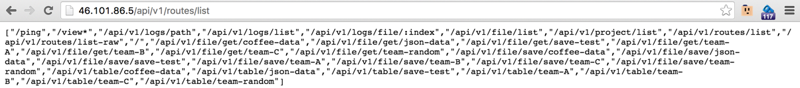

### Pattern - Known Attack Surface

- Note the difference between ```list``` and ```list-raw```
  - the ```list``` is still not complete since the logs are not mapped (at least some of them should be in there, for example the first and last 3 entries)

- add QA tests that use this list to load all pages

**API - routes/list-raw**


**API - routes/list**


