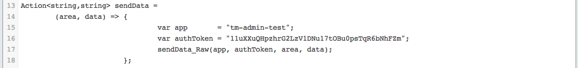

##  First PoC of sending server-side request URLS to Firebase (and seeing it in realtime in an AngularJS page)

After getting my head around how Firebase works (see [Using Firebase to sync data with a webpage (via Javascript, REST and Firebase Admin panel)](http://blog.diniscruz.com/2014/02/using-firebase-to-sync-data-with.html) and [Trying our Firebase (Beta) hosting solution and good example of Firebase Security rules](http://blog.diniscruz.com/2014/02/trying-our-firebase-beta-hosting.html)), I really wanted to see how it could work on a key feature that I've been wanting to add to [TeamMentor](https://teammentor.net/) for ages: **Realtime viewing of traffic and logs**  

And it worked :)

This is really exciting!!! (can you tell :)  ), specially since I can see so many great uses of this type of technique and technology in TeamMentor (for example it will allow for much better understanding on how the content is used, and for better collaboration between its readers (and authors))

I'm going to write a number of blog posts that explain how this works in detail, but the core of it is the C# code shown below ([gist here](https://gist.github.com/DinisCruz-Dev/9252195#file-1-hook-teammentor-beginrequest-and-send-url-to-firebase-c)) which is running on a test TeamMentor instance, and basically hooks into the ASP.net HTTP pipeline in order to send the current URL to Firebase (using [Firebase's REST API](https://www.firebase.com/docs/rest-api.html)):

{lang="csharp"}
    Action<string,string,string,string> sendData_Raw =
    	(app,token, area, data)=>
            	{
                         ThreadPool.QueueUserWorkItem((o)=>
                           	{
    		               var url      = "https://{0}.firebaseio.com/{1}.json?auth={2}".format(app, area, token);
                    	       var now 	    = DateTime.Now.ToShortTimeString(); // DateTime.Now. TimeOfDay;
    		               var postData = "\"{0}: {1}\"".format(now, data.replace("\"", "'"));
    			       url.POST(postData);
                            });
                    };

    Action<string,string> sendData =
    	(area, data) => {
    				var app       = "tm-admin-test";
    				var authToken = "11uXXuQHpzhrG2LzV1DNu17tOBu0psTqR6bNhFZm";
    				sendData_Raw(app, authToken, area, data);
                        	};

    Action<string> logDebugMsg =
    	(message)=>{
    			sendData("debugMsg", message);
            	   };

    Action<string> logRequestURL =
    	(url)=>{
    			sendData("requestUrl", url);
                   };

    if (TMEvents.OnApplication_BeginRequest.size() > 1)
        TMEvents.OnApplication_BeginRequest.remove(1);

    logDebugMsg("mapping TMEvents.OnApplication_BeginRequest to send url to Firebase");

    TMEvents.OnApplication_BeginRequest.Add(
    	()=>{
    		logRequestURL(HttpContextFactory.Request.Url.str());
                });
    return TMEvents.OnApplication_BeginRequest.size();

    //using System.Threading;
    //using TeamMentor.CoreLib;
    //O2Ref:TeamMentor.CoreLib.dll

Here is the AngularJS+Firebase Html app that I created in Eclipse which shows the data received from the TeamMentor website (i.e. all requests made by a client visiting its home page):

... here are the logs for a page that doesn't exist:

... here are the requests for the TeamMentor error page:

**Quick look at the C# code executed on the TeamMentor server** ([gist here](https://gist.github.com/DinisCruz-Dev/9252195#file-1-hook-teammentor-beginrequest-and-send-url-to-firebase-c)):  

Here is how the HTTP pipeline is hooked (using the TMEvents helper object from TM)  

... the **logDebugMsg** and **logRequestURL** lambda functions are used to set the Firebase object to store the received messages:

... the *sendData* lambda function is used to configure the Firebase target app and authorization token:

... the **sendData_Raw** lambda function is the one that sends the REST/POST request to the mapped Firebase app:

Let me know if you have any questions regarding this example.  

**Firebase recovers connection**  

In terms of being able to recover from going offline, Firebase seems to do a good job at reconnecting back to the server once the host box is back online (see image below which happened between me leaving my house and connecting into my current WIFI location)  

