##  Using AngularJS in Eclipse, Part 1) The Basics

This  covers the _**The Basics**_ example from [AngularJS](http://angularjs.org/http://angularjs.org/)'s home page:  

I'm doing this on an OSX laptop and the first step was to download and unzip ([eclipse-standard-kepler-SR1-macosx-cocoa.tar.gz](http://www.eclipse.org/downloads/download.php?file=/technology/epp/downloads/release/kepler/SR1/eclipse-standard-kepler-SR1-macosx-cocoa.tar.gz) (32bit version of Eclipse's Kerpler) into the **_~/_Dev/_AngularJS_** folder.

I fired up eclipse, chose the _~/_Dev/_AngularJS/workspace_ as the workspace root and installed the [Eclipse Grovy REPL Scripting Environment 1.6.0](https://marketplace.eclipse.org/content/eclipse-grovy-repl-scripting-environment) ([update site](http://eclipse-plugin-builder.azurewebsites.net/)) and [Angular-JS Eclipse Tooling](https://github.com/angelozerr/angularjs-eclipse) ([update site](http://oss.opensagres.fr/angularjs-eclipse/1.0.0-SNAPSHOT/)) plugins.

**1) Creating an Angular JS Project**  

After restarting eclipse, I right-clicked on the **_Project Explorer_** view and chose the **_New_** -> **_Static Web Project_** menu item

... set **_AngularJS_Tests_** as the project name and clicked **_Finish_**

... switched to the **_Web Perspective_**

... with the **_Project Explorer_** view now looking like this:

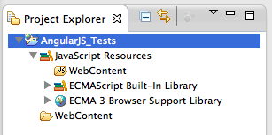

With the final setup being the conversion into an **_AngularJS Project_**

**2) Creating the The_Basics.html file**  

To create the first test file, I right-clicked on the _Web Content_ folder, and chose the _New _-> _Html File_ menu option:

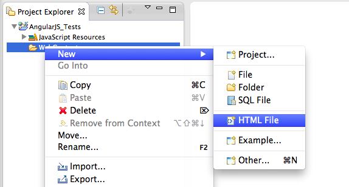

... set the file name to *The_Basics.html* and click on **_Finish_**

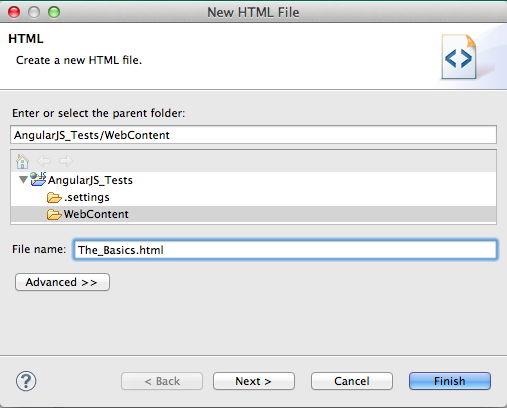

**NOTE:** The reason this first file is called *The_Basics.html* is because I'm going to be using the examples from AngularJS' home page [http://angularjs.org/](http://angularjs.org/)

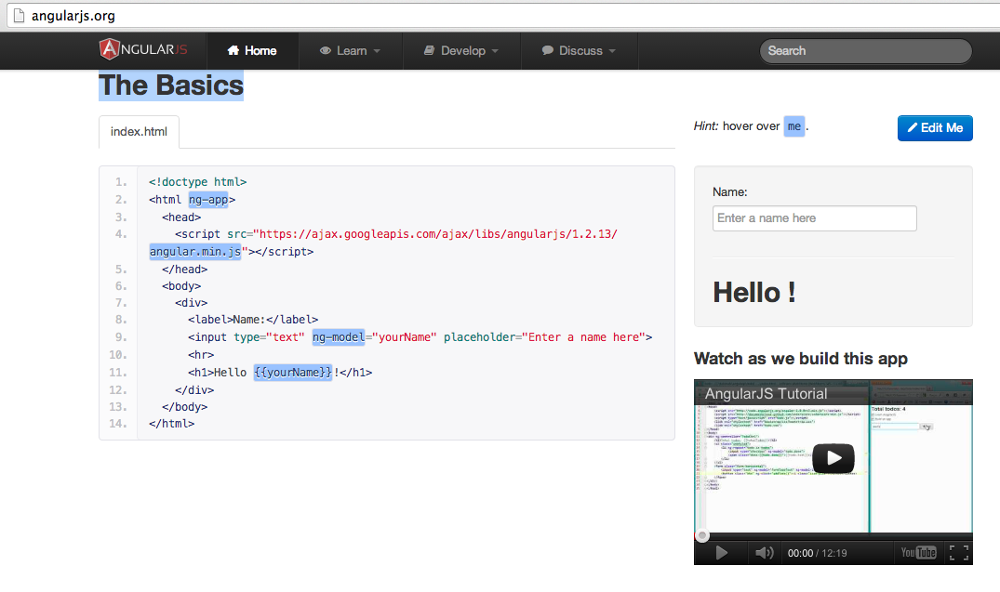

Once the *The_Basics.html* file opens up in eclipse

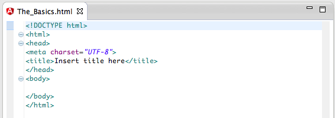

... I change its contents to the code sample from [http://angularjs.org/](http://angularjs.org/)

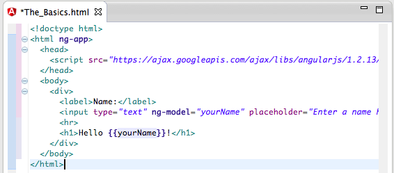

Note how the AngularJS Eclipse plugin successfully detects the Angular attributes and showed relevant information about it.

Here is **_ng-app_**:

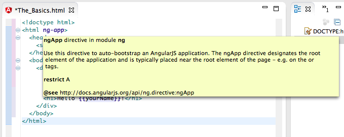

Here is **_ng-model_**:

**3) Fixing the undefined Attribute name issue**  

Since I used Eclipse's **Static Web Project**, when I saved the *The_Basics.html* file, the following error  occurred (if the Eclipse's Html validation settings are the default ones):

... which basically means that Eclipse is not recognising the AngularJS Html attributes:

To fix this, I went to the **_AngularJS_Test_** project's Properties, opened the _HTML Syntax_ page (from the **_Validation_** section) and set to false the **Undefined attribute name **setting (in the **_Attributes_** options , not the **_Elements_** one)  

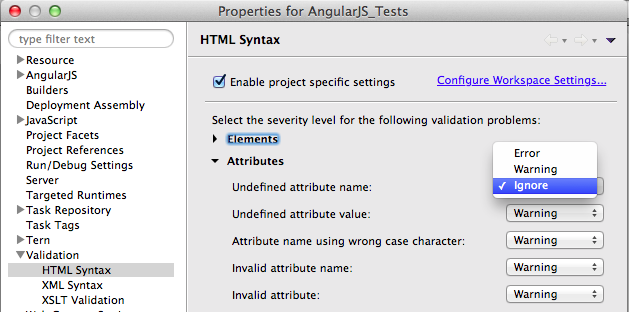

With that config change, there are no problems in this page, and hovering on top of one the AngularJS directives will show the correct tooltip:

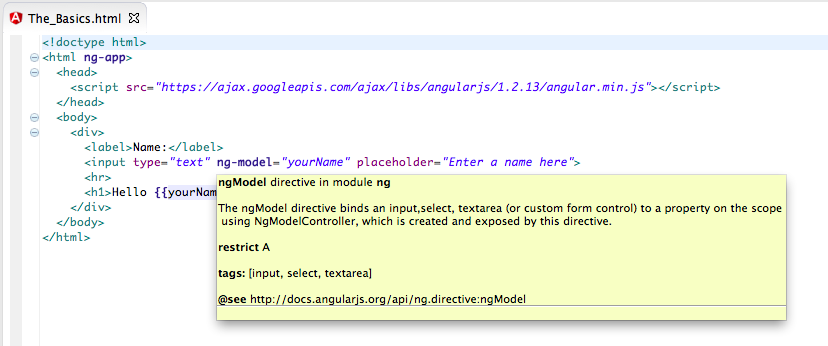

**4) Viewing and previewing the *The_Basics.html* page**

Since at the moment we only have one page, we can view it directly without needing a Web Server.

To do that, I clicked on the html file and chose the **_Web Browser_** option from the **_Open With_** menu:

This will open the default Eclipse Browser

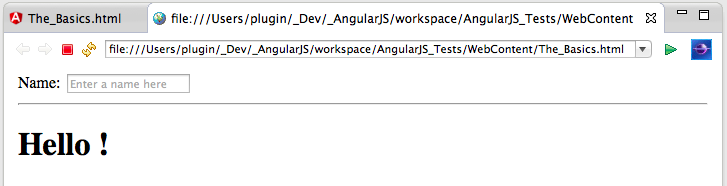

... with the AngularJS test working as expected (in this case any text typed in the **_Name_** TextBox will automatically be shown in the page:

We can also preview some of the changes in real time, by choosing the **_Web Page Editor:_**

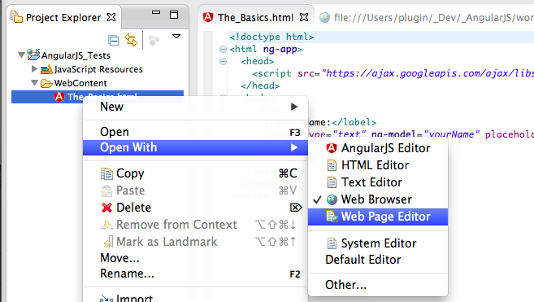

... which will look like this (note the non-processed HTML at the top and the HTML code at the bottom):

Opening up the **_Preview_** tab (from the default **_Design_** tab) will allow us to test the page currently being edited (note how Angular JS is working):

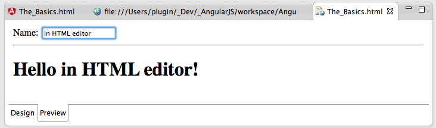

This means that (when in the **_Design_** tab) we can edit the AngularJS HTML page and see the changes immediately:

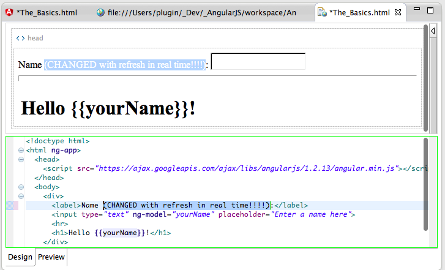

NOTE: This version of the **Web Page Editor **doesn't render the CSS while in that **_Design_** mode, which means that if we add bootstrap to this project:

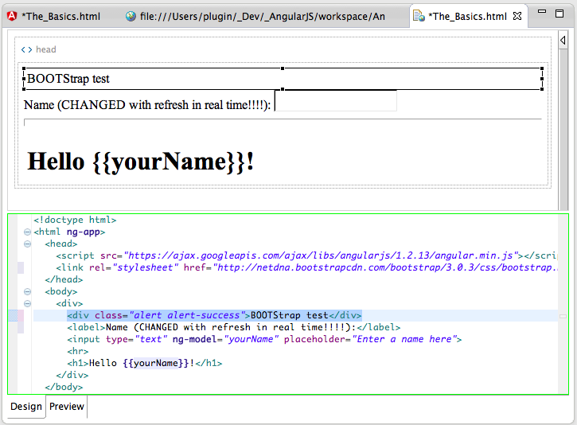

... the CSS will only be visible when in the **_Preview_** tab:  

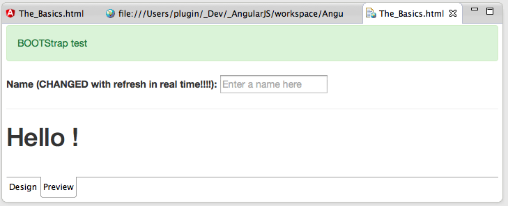

**4) Creating a Git Repository for the files created**  

The best way for me to share these files is via a Git Repository, so the final step of this post is to create one on the files we have already created.

Since we are in eclipse I tried to create an Git Repo for the current project:

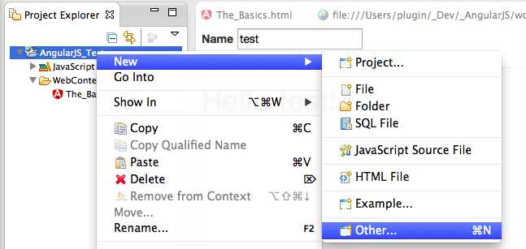

But the *Git Repository* wizard:  

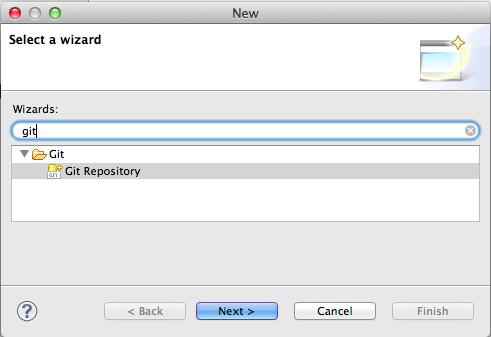

... didn't work, because it expects the target folder to not exist:

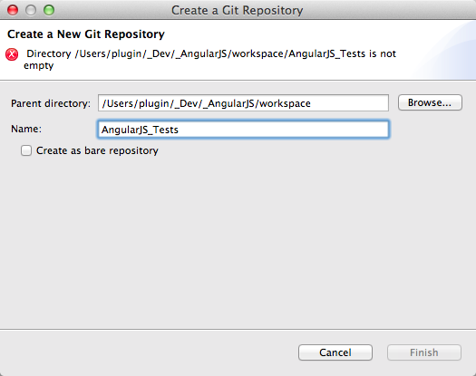

This was easily solved via the command line (by executing _$ git init_ on the **_AngularJS_Tests_** folder)

Now that we have a git repository, I was time to open it:

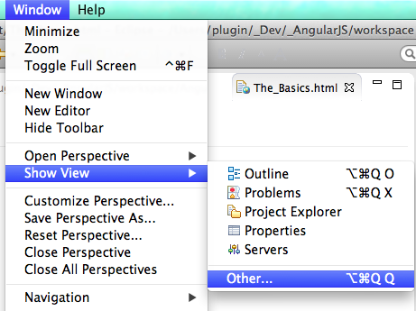

... using the**_ Git Repositories_** view

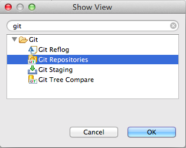

... where we can use the _Add an existing local Git repository_ link:

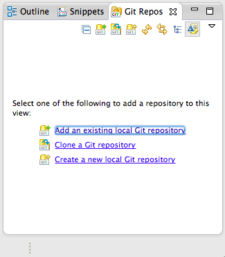

... to open the repository just created:

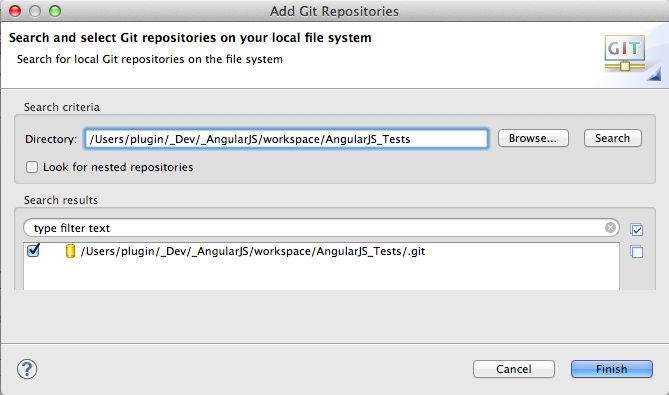

In order to create a git commit, I also opened the **_Git Staging_** view:

This is what these two git views look like (note that there are no commits/references and the list of new files in the **Unstaged Changes** list)

To commit the files drag-n-drop them from the **_Unstaged Changes_** to the _Staged Changes_, and write a commit message:

After clicking the **_Commit_** button the **_Git Repositories_** view will give a visual representation of the location current HEAD (which is the commit just done)

