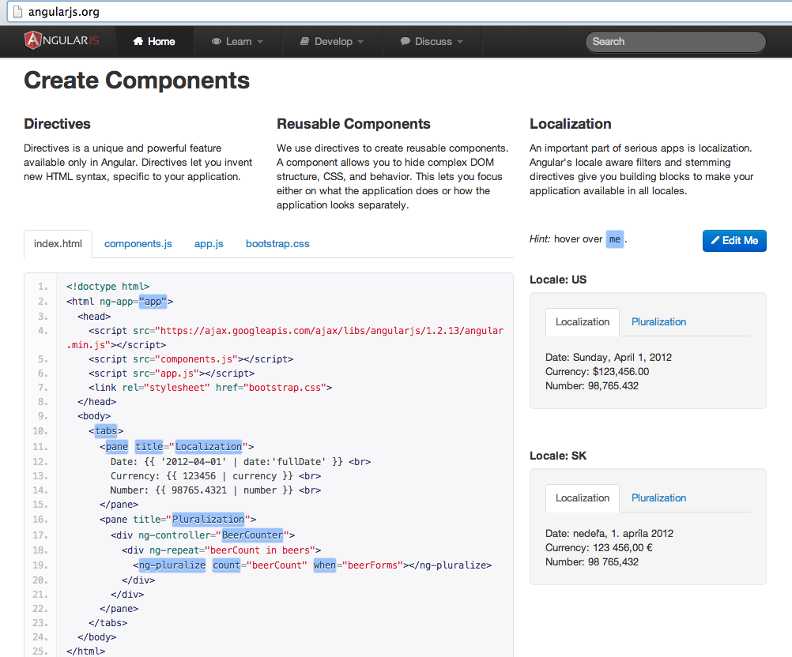
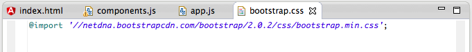
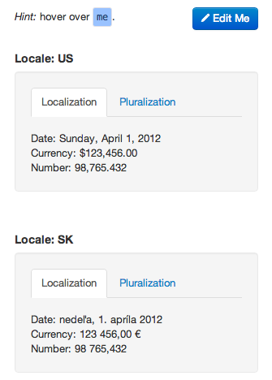
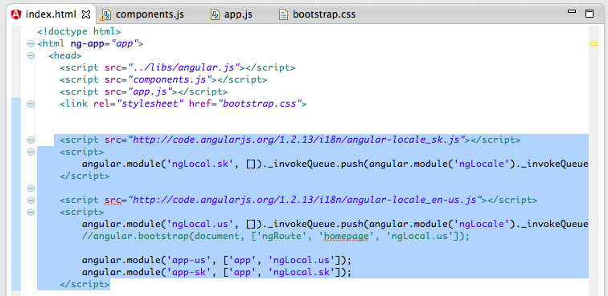
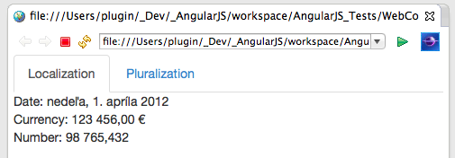
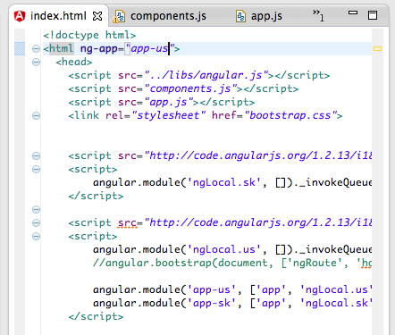
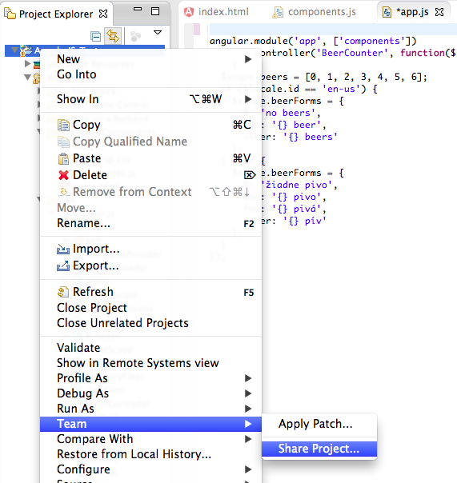
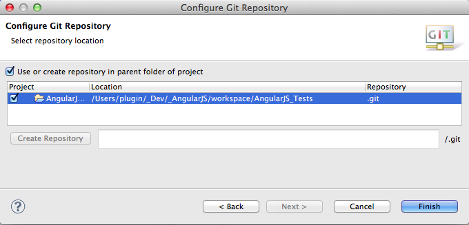
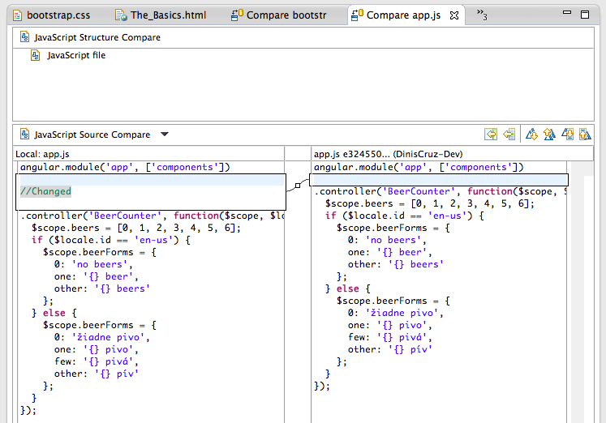

## Using AngularJS in Eclipse, Part 4) Create Components

This  covers the _**Create Components:**_ example from [AngularJS](http://angularjs.org/http://angularjs.org/)'s home page:

**1) Creating the test files**  

First step is to create a folder called _4. Create Components_:

... with the 4 files provided by this example:  

**index.html**  

**components.js**  

**app.js**  

and **bootstrap.css**  

**2) Running in browser (and failing to change locale)**  

Here is what it looks like when loaded locally (in Eclipse):

This example shows how we can create components (i.e directives ) that are able to handle multiple languages or currencies.

The Localization tab (shown above) is currently set for english (USA) and the Pluralization tab (shown below) is currently set to English.

This demo also has support for SK, but there didn't seem to be an easy way to change the browser's locale (so that we can see the SK values in action)

But on the [angular.org](http://angular.org/) page they were able to show both US and SK side by side:

so there had to be a way to do it :)

**3) Programmatically change the locale**

Looking at the code from the [angular.org](http://angular.org/) the code changes made below seem to be the ones required.

Basically we need to:

  * load up the _**angular-locale_sk.js** _file followed by immediately creating a module called _**ngLocal.sk**_
  * load up the _**angular-locale_en-us.js** _file followed by immediately creating a module called _**ngLocal.us**_
  * create a module called **_app-us_** that depends/consumes **_ngLocal.us_**
  * create a module called **_app-sk_** that depends/consumes _**ngLocal.sk**_

Then we can change the **_ng-app_** to be _**app-sk:**_

... and now the locale is SK (i.e. Slovak):

... with the text showing in Slovak (well I hope it does, since I don't speak Slovakian :)  )

If we wanted to have the site back in english (US), we can change the **_ng-app_** to be _**app-us**_

... and we're back in USA currency and English language:

**4) viewing Git Diffs in Eclipse**  

At this stage I wanted to see **git diffs** inside eclipse (for example '_current changes vs last committed code_'), but the option I was looking for ('**_Compare With -> HEAD Revision'_**) was not there.

The problem was that I needed to _'Share current project'_, which can be done via the **_Team_** menu:

After choosing the **Share Project ... **menu option**, I was asked to chose the Git repository type (which is a bit weird since this was already a Git repository)

... and chose to use the repository in the parent folder of the selected project:

Once that completed, I was able to see the **_Compare With -> HEAD Revision_** option:

... which provides this really nice **_Git diff_** UI:

