##  Using AngularJS in Eclipse, Part 3) Wire up a Backend 

This is the third of four posts on how to run (inside Eclipse) the examples provided in [AngularJS](http://angularjs.org/http://angularjs.org/)'s home page:  

* [Using AngularJS in Eclipse, Part 1) The Basics](/manuscript/C1_Using_AngularJS-usingangularjsineclipsepart1thebasics.md)
* [Using AngularJS in Eclipse, Part 2) Add Some Control](/manuscript/C1_Using_AngularJS-usingangularjsineclipsepart2addsomecontrol.md)
* Using AngularJS in Eclipse, Part 3) Wire up a Backend
* [Using AngularJS in Eclipse, Part 4) Create Components](/manuscript/C1_Using_AngularJS-usingangularjsineclipsepart4createcomponents.md)

The example covered on this post is the _**Wire up a Backend:**_

[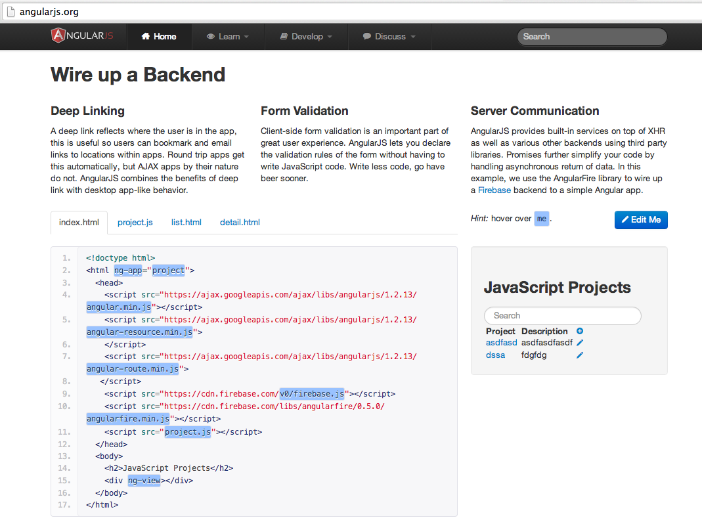](http://2.bp.blogspot.com/-LmHrtR1wgVk/UwZSOT3rM4I/AAAAAAAAHHA/-lYyuV9yJv4/s1600/Screen+Shot+2014-02-20+at+12.44.58.png)

**1) Creating the test files**

First step is to create a folder:

[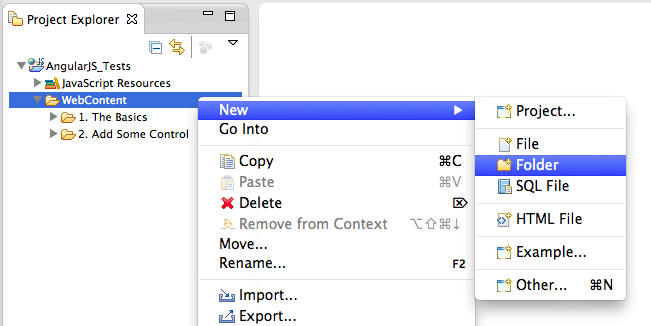](http://4.bp.blogspot.com/-9RvoM-BFNUg/UwZSORWWWwI/AAAAAAAAHG8/2uvty0EmjJ0/s1600/Screen+Shot+2014-02-20+at+12.48.54.png)
  
... called **_Wire a Backend_**

  
... to hold the 4 files required for this example: **_index.html, detail.html, list.html and project.js_**

[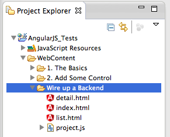](http://1.bp.blogspot.com/-Qbmey9P_VQ4/UwZSOxC_0jI/AAAAAAAAHHI/MHQDZj51VKA/s1600/Screen+Shot+2014-02-20+at+12.50.41.png)
  
Here is what they look like (with content from [http://angularjs.org](http://angularjs.org/))

**index.html :**

[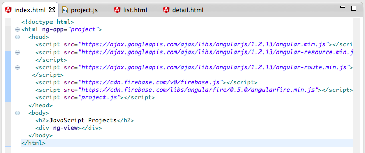](http://4.bp.blogspot.com/-cV55mPXAN6I/UwZSPBlmoGI/AAAAAAAAHHY/v9SpTKeHVi4/s1600/Screen+Shot+2014-02-20+at+12.51.18.png)

**project.js :**

[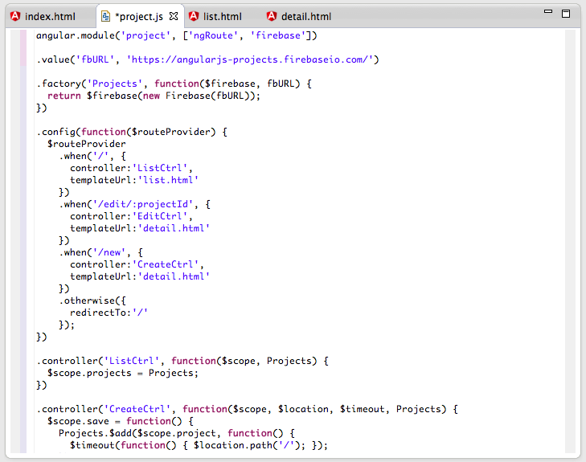](http://1.bp.blogspot.com/-nRfTXlAYPVk/UwZSPoFCFaI/AAAAAAAAHHU/6mvBYddY3WA/s1600/Screen+Shot+2014-02-20+at+12.51.42.png)
  
**list.html :**

[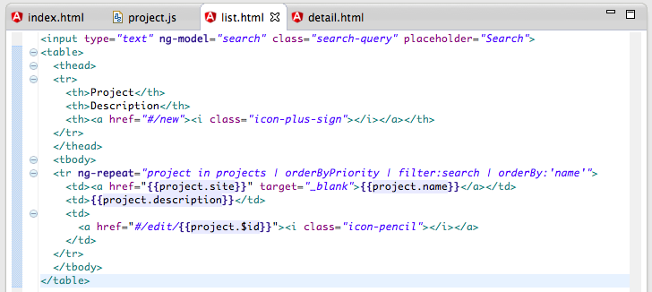](http://3.bp.blogspot.com/-52LYMTHNn3M/UwZSQdou9PI/AAAAAAAAHHg/uiCsOWelzRY/s1600/Screen+Shot+2014-02-20+at+12.52.01.png)
  
**detail.html :**

  
**2) Running in Browser and noticing CSS problems**

To see this example in action, lets open it in Eclipse's WebBrowser:

... which looks like this:

  
... with a search bar at the top that can be used to filter the loaded data:

  
Only problem is that it doesn't look at all like it does on the [http://angularjs.org](http://angularjs.org/) page (see below)

[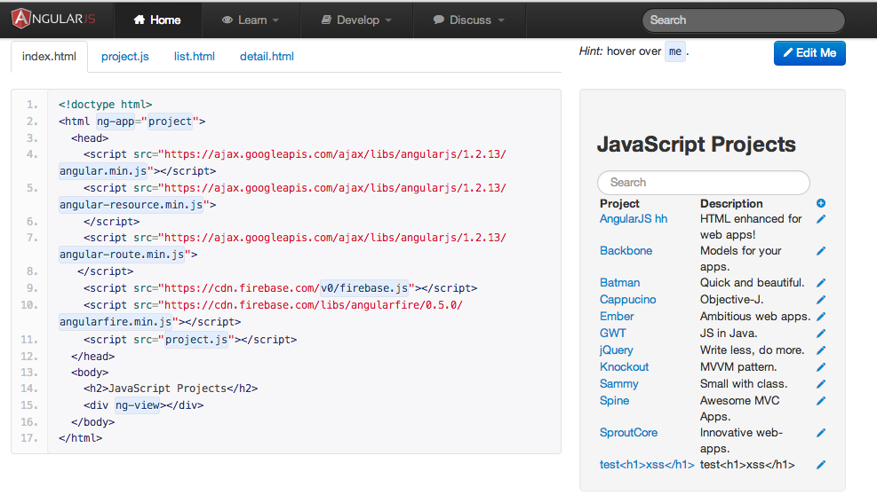](http://4.bp.blogspot.com/-SOaPvX9UHb0/UwZSSkFZ5ZI/AAAAAAAAHIc/Qo2-IQhgQ48/s1600/Screen+Shot+2014-02-20+at+12.56.10.png)

Note how not only the css styles are different, the **_add_** and **_edit_** links (i.e. icons) are missing:

Here is what the **_edit_** page should look like:

Here is what the _new _page should look like:

  
**3) Running example on JSFiddle**  

On the [http://angularjs.org](http://angularjs.org/) page there is a button called _Edit Me_ (top right) which when clicked will do a cross-site POST submission to [http://jsfiddle.net/api/post/library/pure/](http://jsfiddle.net/api/post/library/pure/)

... which looks like this (notice the extra [Bootstrap](http://getbootstrap.com/) css included that is not present on the code sample provided in the [http://angularjs.org](http://angularjs.org/) page )

For reference here is what the _Edit Me_ form looks like in the [http://angularjs.org](http://angularjs.org/) page (with the values passed as hidden parameters to **_jsfiddle_**)

  
And here is the jsfiddle API description for the method used ([http://doc.jsfiddle.net/api/post.html](http://doc.jsfiddle.net/api/post.html))

  
**4) Fixing CSS issue**

Since I wanted to match the CSS of my local test page to the style used in the example embedded in the  [http://angularjs.org](http://angularjs.org/) page, the best place to look is on the source code code of that page :)

Using Chrome Browser Inspector, on the _Styles _tab, I was able to see that they were using two css libraries: [Bootstrap](http://getbootstrap.com/) and [Font Awesome](http://fortawesome.github.io/Font-Awesome/):

  
Back in Eclipse, I added the bootstrap css reference

And on refresh, the page looked better (but the **_edit_** and **_add_** icons/links where still missing)

[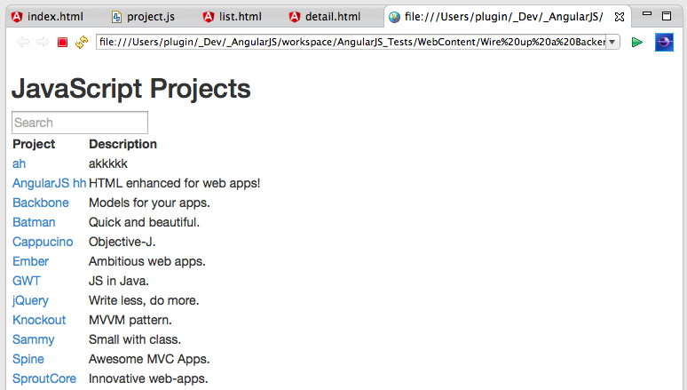](http://3.bp.blogspot.com/-7MglsZciksk/UwZSWgoTOcI/AAAAAAAAHJA/FYT95N3W9F8/s1600/Screen+Shot+2014-02-20+at+13.00.53.png)
  
So I went back to the angularjs.org source code to see what they were using:

[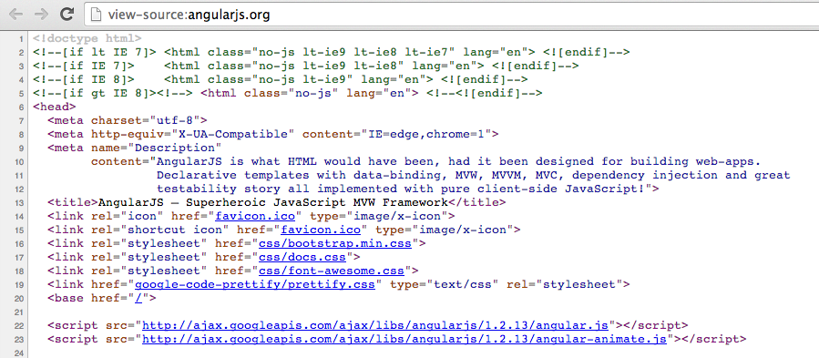](http://1.bp.blogspot.com/-Nh7RaNR6x1Y/UwZSW1VGEkI/AAAAAAAAHJI/YE_TKvC3e4s/s1600/Screen+Shot+2014-02-20+at+13.01.24.png)
  
First I tried adding the latest [Font Awesome](http://fortawesome.github.io/Font-Awesome/) from their CDN:

But since that didn't work, I decided to add both **font-awesome.css **and** docs.css **references:

  
... with much better results (note the icons on the right)

  
But there was still something wrong, since the **_new_** page looked like this:

[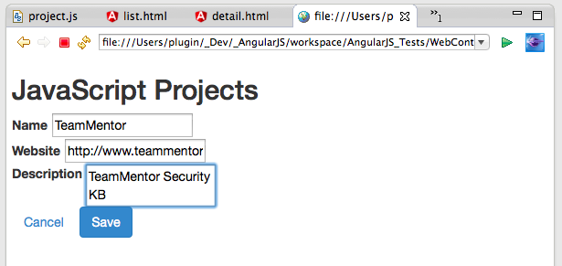](http://4.bp.blogspot.com/-Re6PmYx4oMA/UwZSY1GMljI/AAAAAAAAHJw/Hg5w2EfSH-g/s1600/Screen+Shot+2014-02-20+at+13.04.46.png)

... and the **_edit_** page looked like this:  

[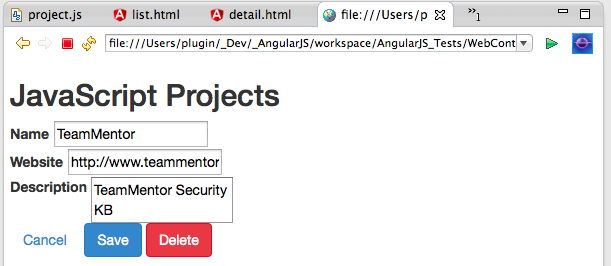](http://1.bp.blogspot.com/-Uct0eEwguKo/UwZSZwlfMUI/AAAAAAAAHKE/GxxgbK8066w/s1600/Screen+Shot+2014-02-20+at+13.05.27.png)
  
Since it was all good on the angular.org site, my next try was to use the **_bootstrap.min.css_** file from it (vs the CDN)

[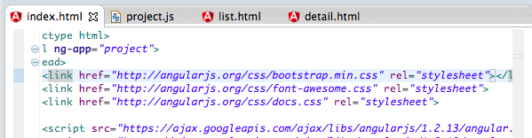](http://3.bp.blogspot.com/-boxmXe8L1uE/UwZSa2hLhBI/AAAAAAAAHKY/G06G6dpsMIs/s1600/Screen+Shot+2014-02-20+at+13.06.34.png)
  
With the local page:

  
... and the **_edit_** page now looking just like the real thing (note the Search TextBox (above) and the fields (below))

[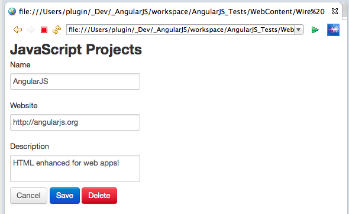](http://4.bp.blogspot.com/-wR06kqYaeJM/UwZSbgnf7cI/AAAAAAAAHKc/_HsT0taKRCg/s1600/Screen+Shot+2014-02-20+at+13.07.09.png)
  
That said, the layout where still a little bit different (namely the background of the local file which was white).

So I had a look at the style of the example in angular.org and noticed that there was a _div _element with the bootstrap classes **well **and** ng-scope**:

[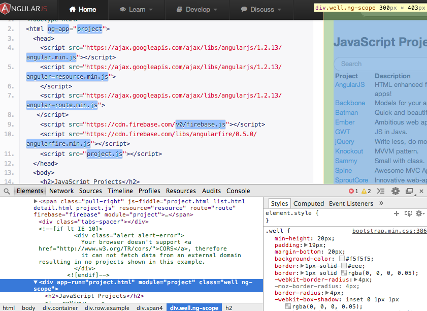](http://4.bp.blogspot.com/-G7jVQFIf5Kc/UwZScHDlCgI/AAAAAAAAHKw/5-af8iWtzbM/s1600/Screen+Shot+2014-02-20+at+13.09.12.png)
  
Back in the local file, I edited the index.html to also have a similar div:

  
And finally the local form looked just like the original:

[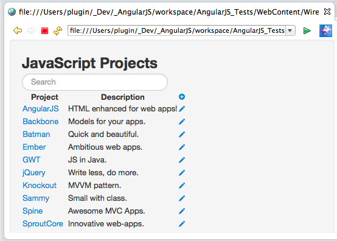](http://4.bp.blogspot.com/-P2WQLTMU_OM/UwZSdAzBoXI/AAAAAAAAHK4/qeQrbsRJV00/s1600/Screen+Shot+2014-02-20+at+13.09.41.png)
  
**5) Running local sample on multiple browsers **

At this stage I was curious on what this form would look like on multiple browsers, and found out something interesting.

Here is the page on Safari (left) and Firefox (right), which are loaded ok:

  
But on Chrome, it doesn't work at all, and the culprit is security!

Basically chrome does not allow Cross origin requests from html files loaded from the local disk (which does make sense from a security point of view).

As a final little comment, in case you noticed that on the Firefox screenshot the Angular content was correctly displayed but the icons didn't show up, that much be a similar problem with loading **_Bootstrap_** or **_Font Awesome_** from the local disk

Here is the same example running on Firefox browser, so it works when loaded from http:

[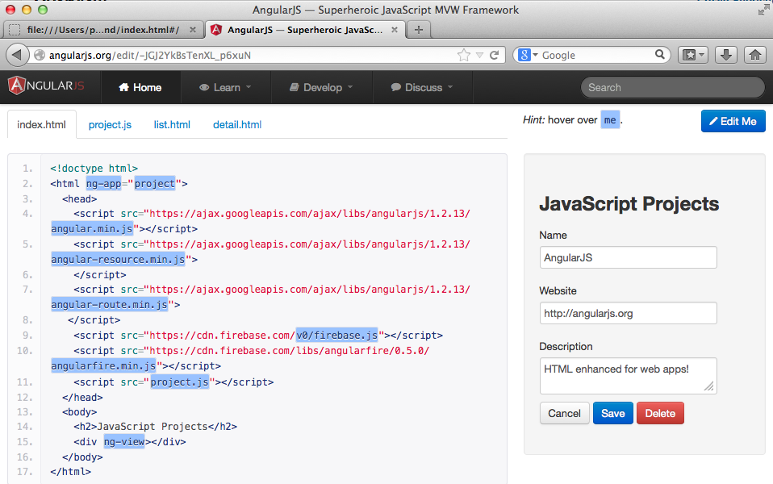](http://4.bp.blogspot.com/-1bHY2qKGZo4/UwcyODBK-2I/AAAAAAAAHM0/G_Xqb61JQsM/s1600/Screen+Shot+2014-02-21+at+11.01.06.png)

**Firebase**  

This example uses the [Firebase](https://firebase.org/) which is a very powerful API to store and sync data in realtime.

After writing this post, I spend some time researching how it works and can be used.

Here are some posts I've written about Firebase:

  * [Using Firebase to sync data with a webpage (via Javascript, REST and Firebase Admin panel)](http://blog.diniscruz.com/2014/02/using-firebase-to-sync-data-with.html) 
  * [XSS considerations when developing with Firebase](http://blog.diniscruz.com/2014/02/xss-considerations-when-developing-with.html) 
  * [Trying out Firebase (Beta) hosting solution and good example of Firebase Security rules](http://blog.diniscruz.com/2014/02/trying-our-firebase-beta-hosting.html) 
  * [First PoC of sending TeamMentor's server-side request URLS to Firebase (and seeing it in realtime in an AngularJS page)](http://blog.diniscruz.com/2014/02/first-poc-of-sending-teammentors-server.html) 
  * [A really SIMPLE and clean AngularJS+Firebase example](http://blog.diniscruz.com/2014/02/a-really-simple-and-clean.html) 
  * (if you are reading this after Feb 2014) checkout the [Firebase section of this blog](http://blog.diniscruz.com/search/label/Firebase) for newer posts 

- - - - 
[Table of Contents](../Table_of_contents.md) | [Code](../Code)