##  Running KarmaJS's AngularJS example test/e2e/angular-scenario (on Chrome)

To learn and get an idea of how [Karma](http://karma-runner.github.io/0.8/index.html) (the _'Spectacular Test Runner for JavaScript'_) works, and how it can be used to create browser automations tests, here are the steps I took to get the [test/e2e/angular-scenario](https://github.com/karma-runner/karma/tree/master/test/e2e/angular-scenario) example to work.

It all started with a clone of: [git@github.com:karma-runner/karma.git](mailto:git@github.com:karma-runner/karma.git)  

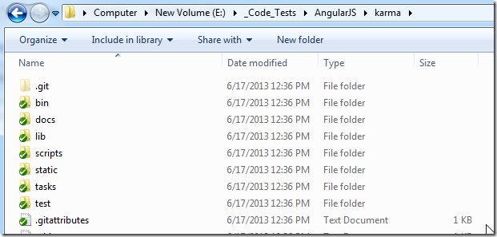

With this KarmaJS test example (see below), being the one that we are going to use:

I then opened an nodejs command prompt and navigated to the folder shown above:

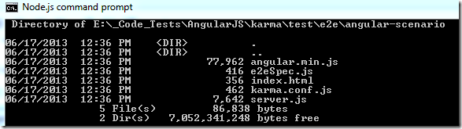

... used **_node server.js_** to start a local webserver

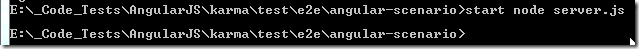

... on port 8000:

The test case we are using (on KarmaJS's **_test/e2e/angular-scenario_**) is a simple AngularJS example, which just consumes the angular-min.js file model attribute:

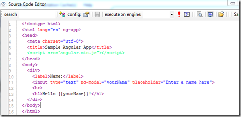

... and uses angular to populate the **_{{yourName}}_** value dynamically (wired to the input field via the **_ng-model="yourName"_**)

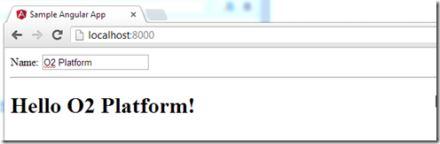

Next we are going to run this [Jasmine](http://pivotal.github.io/jasmine/) test using KarmaJS

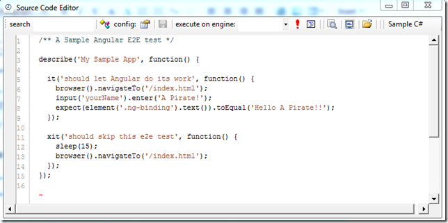

... which _should_ work with just: **karma start karma.conf.js**  

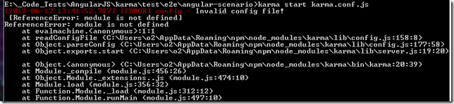

... but it didn't

There is a module dependency missing, which in this case can be resolved by running this command from the root of the karma repository:

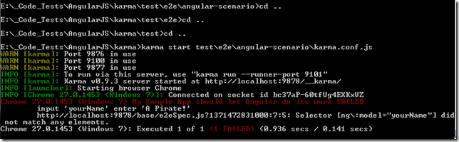

**Note:** the issue above was caused by the fact that I had an the official released version of karma installed globally which is the one that was running when I tried it on the 'test/e2e/angular-scenario' folder'

And now (based on an option from the karma.conf.js) a Chrome window opens up:

Clicking on the **_Debug_** button:

... we can more details on the test that failed:

In this case the problem is that the 'proxy mapping' that karma does is not correct

If we look at the karma.config.js file

.... and the unit test **_brower().navigateTo_** command

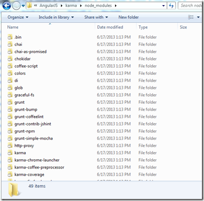

... we can see that karma will try to open **_/index.html_** from _**http://localhost:8000/test/e2e/angular-scenario/index.html**_

That is not going to work since the page we want it is on **http://localhost:8000/index.html** (which happened because we started **_node server.js_** on the **.../test/e2e/angular-scenario** folder)

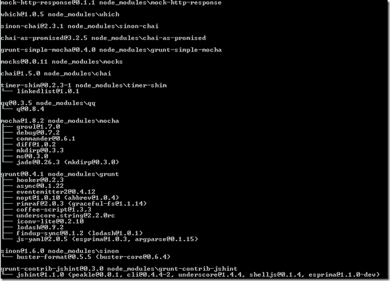

One way to solved this, is to change the 'proxies' mapping to **_'/' : 'http://localhost:8000/'_**  

... and after stopping and starting the karma server:

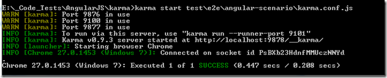

all tests pass :)

**Changing and executing tests in real time**  

What is really cool with this set-up is that (as long as the karma process is running), because the **autoWatch** value (in _**karma.config.js**_) was set to true, if I make a change to the test file:

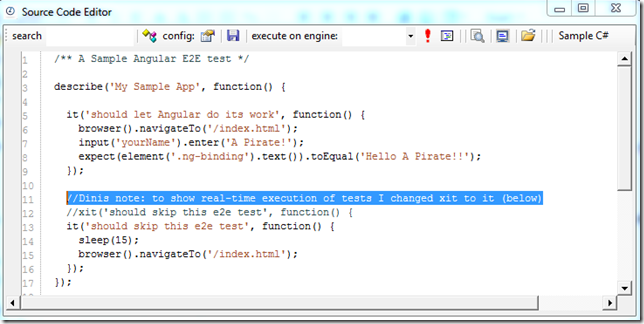

... the karma runner will detect the changes and rerun the tests (note that there are 2 tests executed now)

This 2nd test shows an interesting behaviors since it will make the test wait for 15 seconds (with the browser window opened):

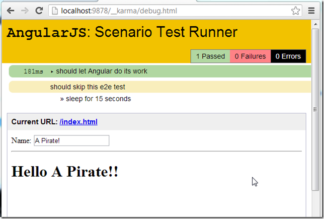

Note how the time execution time for the 2nd test was ~15 secs

And if we modify the 2nd test to:

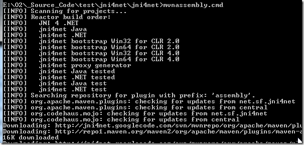

... the execution test UI will look like this (note that the execution was triggered when I saved the test file :)

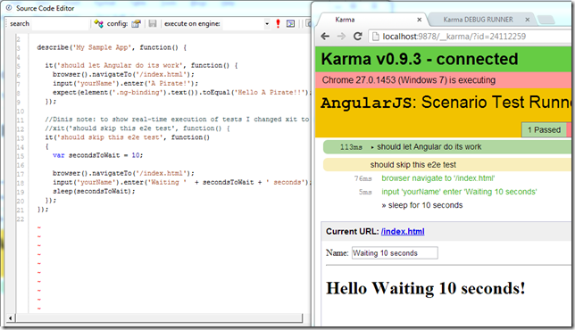

**NOTE 1:** to solve the ENOENT error shown the first screenshot of localhost:8000, we need to add a favicon.ico file to the **lib/nodeserver** folder

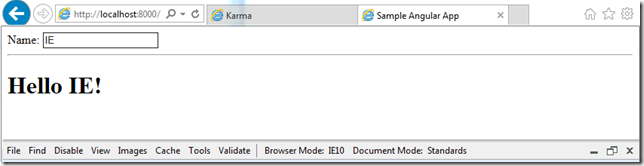

... and now the error doesn't happen anymore

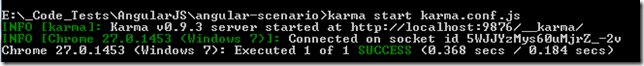

**Note 2:** when trying to run Karma for the first time, I had a prob with grunt where it was failing with an **_Error: spawn ENOENT_**:

... this was resolved by installed the 32bit version of nodeJS and running **_npm install_** on the karma folder (after cloning it)

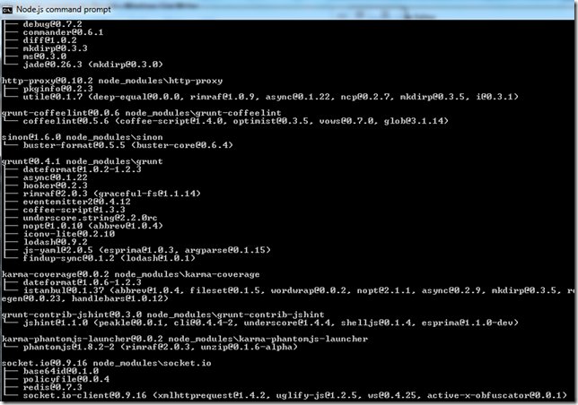
