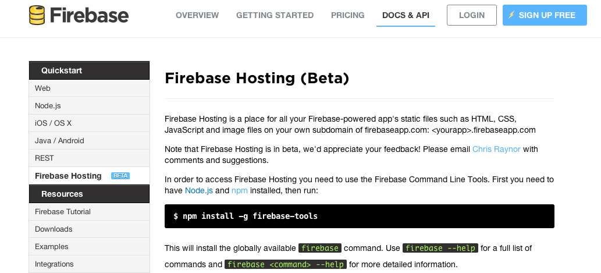
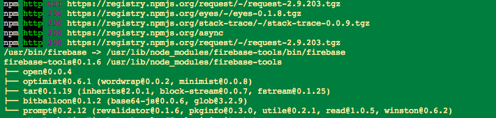
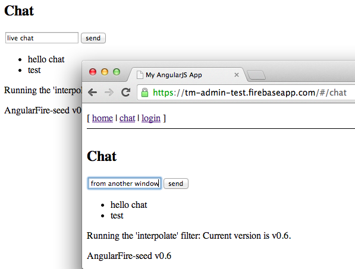
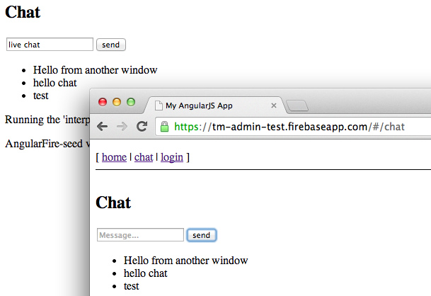
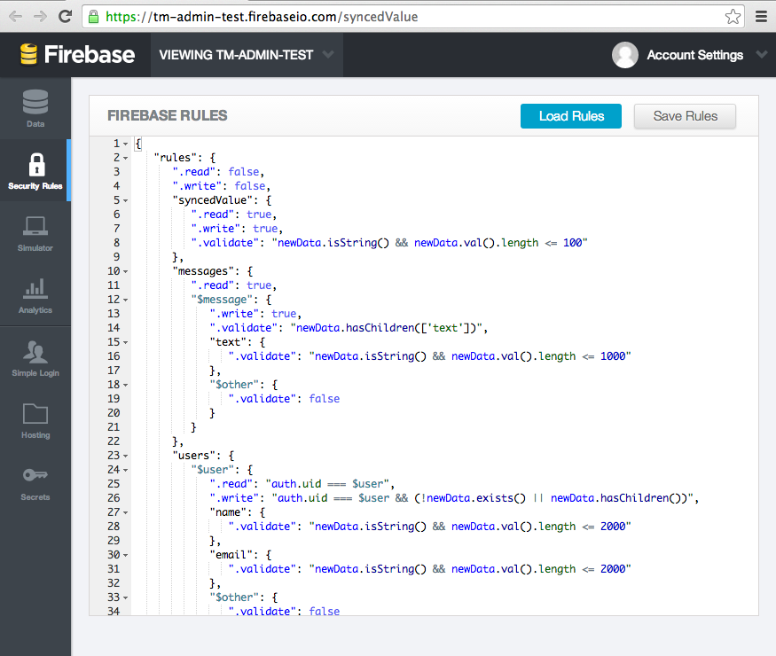
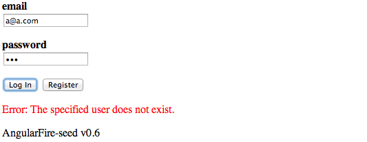
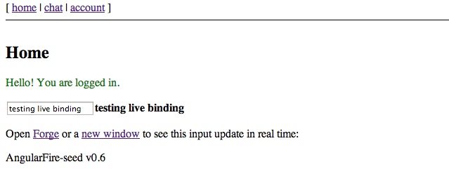
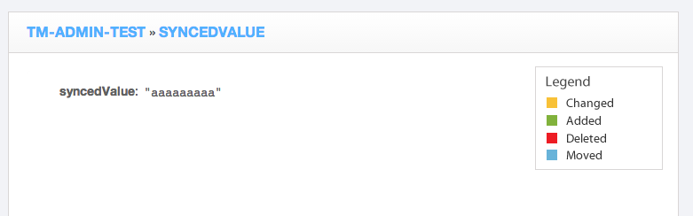

##  Trying out Firebase (Beta) hosting solution and good example of Firebase Security rules 

Since Firebase now offers a [Beta hosting service](https://www.firebase.com/docs/hosting.html) (and I was looking for a quick way to publish one of the firebase PoCs I'm working at the moment), I decided to take it for a spin.

I have to say that I'm really impressed with the end result, and as you will see below, there entire process (from install to published website) was really smooth.  

Note 1: in the example below I already had created an Firebase app to hold the data (see [Using Firebase to sync data with a webpage (via Javascript, REST and Firebase Admin panel)](http://blog.diniscruz.com/2014/02/using-firebase-to-sync-data-with.html) for details on how to create one) 

  

Note 2: at the time I wrote this post, the website created is/was (depending on when you are reading this) hosted at [https://tm-admin-test.firebaseapp.com/](https://tm-admin-test.firebaseapp.com/)

  

Starting with the instructions from [Firebase hosting](https://www.firebase.com/docs/hosting.html) page:

****  
**  
**

  

1) Install the firebase tools

  

  

 ....

**  
**

**2) Run the firebase BootStrap**

  

  
... after logging in (above), we are asked to chose the 'firebase' app to use (below)

  
... then pick the template to use (I chose the **_angular_** one)

  
 ... and that's it:

  
Here are the files created locally (all under the **_tm-admin-test_** folder)

**3) Deploy the application**

  
... which is also super quick.

After completion the default browser is opened with the created website, which looked like this:

  
**4) Testing the test app**  
**  
**The created/published test app has a simple [Firebase 3-way data binding](https://www.firebase.com/blog/2013-10-04-firebase-angular-data-binding.html) example, where changes in an **_angular-binded _**model, are propagated to the server, and distributed to any connected clients (the image below shows two browsers and the firebase admin panel, all synced in real time (regardless where the data is changed))  
**  
**  

  
There is a basic **Chat **page:

  
... which allows new messages to be added and viewed in real time:

  
Also included is a Login page (with account creation capabilities):

**5) Review the security rules**

At this stage it's good to take a look at the security rules added to this Firebase app.

  
In the image below we can see that:

  * Anonymous users **_can_** **_read_** all data, but **_not write_** by default
  * The **_syncedValue_** object **_can be read and written_** by all

    * there is a validation on this field that ensures that it is not empty and not bigger that 100 chars

  * The **_messages_** object (i.e. 'firebase section/subdomain'):

    * can be read by all
    * each message must include a property called_ text _with a max length of 1000 chars
    * (I think) the **_.validate = false_** means that no other properties can be added

  * the **_users_** object:

    * each **_$user_** child object:

      * can be read if the current user matches its name (i.e. it is logged in as that user)
      * each user can write into two fields: _**name**_ and **_email_** (both with a max length of 2000) 
  

  
**6) Create an account**  

To test the provided authorisation solution, let's start by trying to login with an account that doesn't exist:

  
 ... then click on the **_Register_** button (which just adds a **_confirm pass_** field)

  
Here is what the 'post register/login' page looks like (note that the top-menu-bar **_login_** link was also changed to **_account_**)

Clicking on _home_ takes us to the first page, which also shows a different message (now that we are logged in)

  
Interestingly the **_Chat_** page doesn't seem to take into account that we are logged in now (would be nice to show the current user in the message posted)

  
**6) Take a look at data (as stored in the assigned Firebase app)**  
**  
**Using the control panel for the current app:

a) here is the **_syncedValue_** object

  
b) here is the **_messages_** object (which is a firebase kind-of-array, based on a name/value pair. The name is the **_node_** text (for example_ -JGoCMZRRGo1WQHmYxmc_) and the value is the child _text_ node value (for example _test _)):

  
c) There was a new **_users_** node/object in the root of the app's data:

  
... which contains the user provided (and 'editable by that user') data (_email_ and _name_)

  
And where is the user's credentials?

The user created was added to the current list of 'registered users' , and it must be stored somewhere inside firebase servers since we don't have access to it (hopefully it is stored using a nice strong hashing algorithm)

  
**Wrapping up**  
**  
**Kudos to the Firebase team for providing such easy-to-use hosting solution (next step for me is to try to use it in the TeamMentor PoC I'm currently working on)  
**  
**For reference the AngularJS+Firebase website that was created by the Firebase cli tool, is the one available at [https://github.com/firebase/angularFire-seed](https://github.com/firebase/angularFire-seed) (which contains a nice **README.md **file with more details)

  

  

- - - - 
[Table of Contents](../Table_of_contents.md) | [Code](../Code)