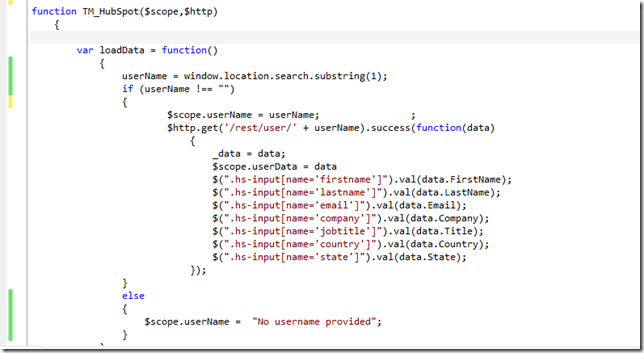
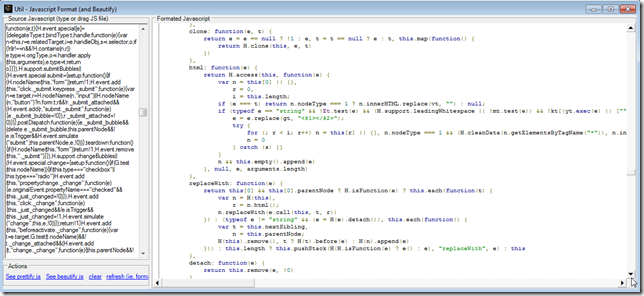
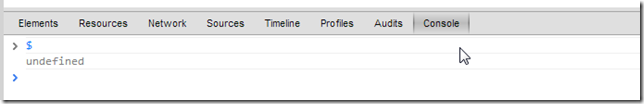
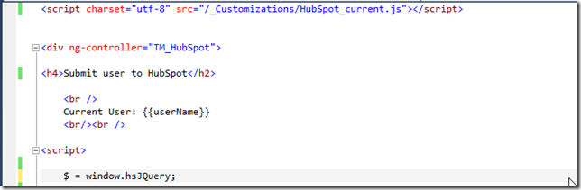

##  Hubspot current.js code includes JQuery on it 

Although I'm using Angular.js on the HubSpot TBot page (see [Submitting TM users to HubSpot via TBOT interface (using Angular JS)](http://blog.diniscruz.com/2013/04/submitting-tm-users-to-hubspot-via-tbot.html) ) I'm still more comfortable/knowledgeable in jQuery, so I decided to use it to populate the HubSpot fields.

So my first action was to load jQuery at the top of the TBot page:

which allowed me to do this:

(note the mix of JQuery and AngularJS code)

But then as I looked through the [http://js.hubspot.com/forms/current.js](http://js.hubspot.com/forms/current.js) file (which you will also notice that for TM, I saved it on the **_/_Customizations_** folder)

In the **_Util - Javascript Format (and Beautify).h2_** O2 Platform tool:

I noticed that they had embedded **_jQuery _**in the **_current.js_** code, namely at the **_window.hsJQuery_** variable

this means that we can use jQuery to access the page's DOM

Now, if we remove the jQuery script import:

the **_$_** variable will not be available:

But if we assign **_$_** to **_window.hsJQuery_**, we are back in action:

Finally, we add that assignment to the TBot page

And the previous code (that used the **_$_**) is working again (now using the JQuery version from **_current.js_**) 

- - - - 
[Table of Contents](../Table_of_contents.md) | [Code](../Code)