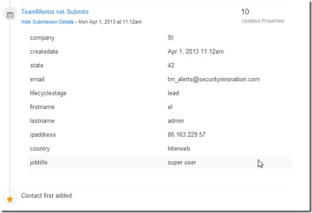
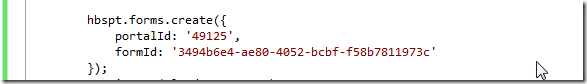
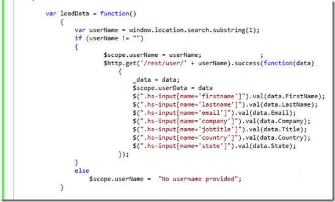

##  Submitting TM users to HubSpot via TBOT interface

Following the need to submit TM new users to HubSpot, I just created an TBot razor page (TM admin script) that uses Angular JS to get data about a particular user and populates a form that can then be submitted to HubSpot.

Here is what the Form looks like for the admin user (value provided on the url):

Pressing the Submit button will send the data to HubSpot which is captured like this:

This works using the new HubSpot form API and Structure (which is quite nice).

The form is created using this HubSpot provided script:

Which is then auto-populated using Angular.js

