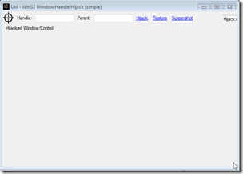
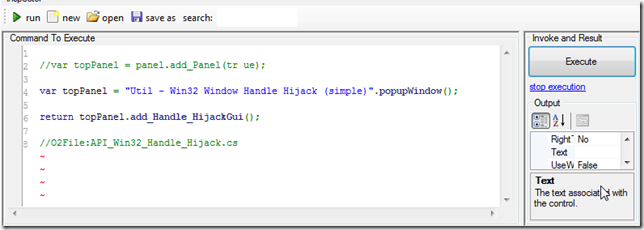
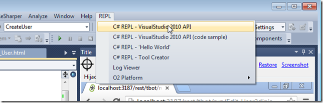
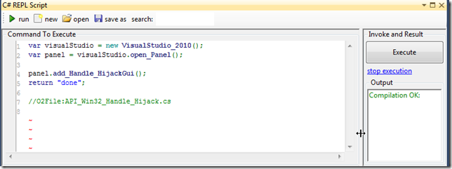
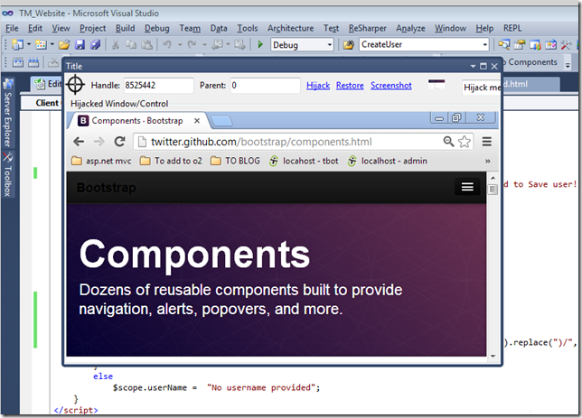

##  Using Chrome inside a native VisualStudio pane (using Window Handle Hijacking) 

To help me debug and visualize an [AngularJS](https://www.google.co.uk/url?sa=t&rct=j&q=&esrc=s&source=web&cd=1&cad=rja&ved=0CDMQFjAA&url=http%3A%2F%2Fangularjs.org%2F&ei=Fv03UbbUF4TZPIq-gegB&usg=AFQjCNF_LWQwZlAQzMLiHoSWsZBxLguMng&bvm=bv.43287494,d.ZWU) page I was developing, I used the O2's [Window Handle Hijack](http://blog.diniscruz.com/search/label/WinAPI) technique to insert an Chrome window inside VisualStudio 2010.

Here it is in action:  
  

On the right you can see a full chrome window, inserted inside a VisualStudio dockable pane.

On the left you can see the AngularJs file (rendered from a RazorSharp template) that I can edit and quickly view its output on the right-hand-side Chrome window (with no web recompilation needed)

To create this, I searched in [O2 Platform](http://blog.diniscruz.com/p/owasp-o2-platform.html) for the **_Util - Win32 Window Handle Hijack (simple).h2_**  script

 which looks like this: 

Had a look at its source code to see how it was created (note the Extension Method **_add_Handle_HijackGui_** ):

Then inside a VisualStudio, I opened a C# REPL script:

This gave me access to the **_VisualStudio_2010_** API

where I can use the Extension Method **_add_Handle_HijackGui_**   

to create a native VisualStudio pane with the **_Windows Handle Hijack Gui_**  

With this GUI, we can grab any Window's Window, by dragging the target icon (top left) into the window we want to use/hijack:

Tip: before Hikacking a window, it is a good idea to take a screenshot and see if we have the right one:

Once we're sure, just hit the **_Hijack _**link, and we will have  have a fully functional Chrome window that we can place anywhere inside VisualStudio's GUI.

For example, we can place it in the documents area as one of the source code files  
(tip: double click on the 'Hijacked Window/Control' text to hide the hijack controls)

As a final example, here is what it looks like if we just Hijack the browser's website window (without the navigation and top bars)

- - - - 
[Table of Contents](../Table_of_contents.md) | [Code](../Code)