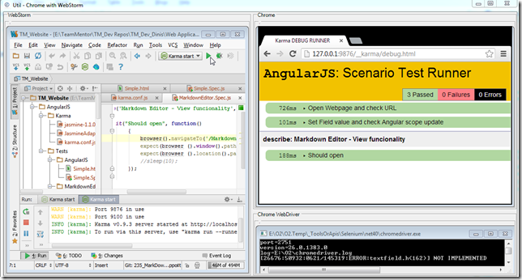
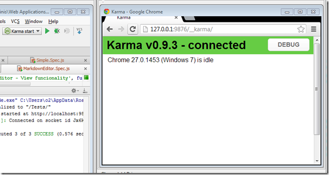
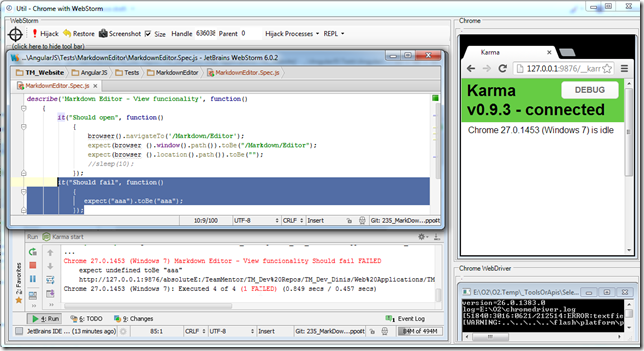

##  Using WebStorm with Chrome and ChromeDriver (to view KarmaJS execution results) 

Following from the example described in[When the best way to automate Chrome is to use ... Chrome](http://blog.diniscruz.com/2013/06/when-best-way-to-automate-chrome-is-to.html) ,  here is a more practical scenario where I'm creating a GUI that has both WebStorm and Chrome running side-by-side

Here is what it looks like:  
  

What makes this example practical is the KarmaJS auto execution on file change, just like it was described in [Adding KarmaJS support to WebStorm to automagically run tests on file changes](http://blog.diniscruz.com/2013/06/adding-karmajs-support-to-webstorm-and.html)

Here is the code that creates this GUI (with some functionality [since the last example](http://blog.diniscruz.com/2013/06/when-best-way-to-automate-chrome-is-to.html), but it still needs to a bit of work to make it more robust):  

    
    //var topPanel      = panel.clear().add_Panel();   
    var topPanel  = "Util - Chrome with WebStorm".popupWindow(1200,600);  
    var webStormPanel = topPanel.add_GroupBox("WebStorm").add_Panel();

    //we need to stop any existing WebStorm processes  
    foreach(var process in Processes.getProcessesCalled("WebStorm"))  
    process.stop().WaitForExit();

    // start webstorm   
    var webStorm = @"C:\Program Files (x86)\JetBrains\WebStorm 6.0.2\bin\WebStorm.exe".startProcess();

      
    var chromeHijack = new API_Chrome_Hijack().open_ChromeDriver()  
    .add_Chrome_To_Panel(topPanel.insert_Right());  
    //.add_WebDriver_ScriptMe_To(replPanel);

    //wait for main window handle  
    webStorm.waitFor_MainWindowHandle();  
    //hack to deal with the splash screen  
    3000.sleep();

    //hijack WebStorm window  
    chromeHijack.hijack_Process_Into_Panel(webStormPanel,webStorm);

    chromeHijack.ChromeDriver.Navigate().GoToUrl("http://127.0.0.1:9876/__karma/debug.html");

      
    //O2File:API_Chrome_Hijack.cs  
    //O2Ref:WebDriver.dll  
  
When executed for the first time, this GUI looks like this:

Them if we start KarmaJS:

... a listener will start (waiting for browsers to connect):

Refreshing the browser will 'capture it' and manually execute the tests:

Opening up the normal page will start the 'auto test execution loop':

... and if we add a new test and save the file, the unit test execution will occour

  
Note: there is some kind of weird event race-condition happening and the keyboard key's events are not being fired inside the captured WebStorm. So in the case shown above, I open the file to edit in a WebStorm popup window, where the keyboard events fire-up ok (and I was able to make the changes to the unit test file) 

- - - - 
[Table of Contents](../Table_of_contents.md) | [Code](../Code)