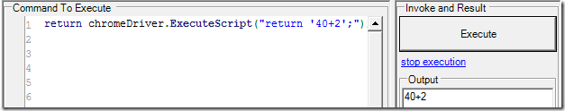
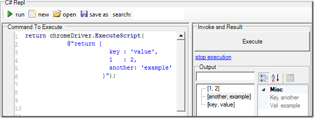
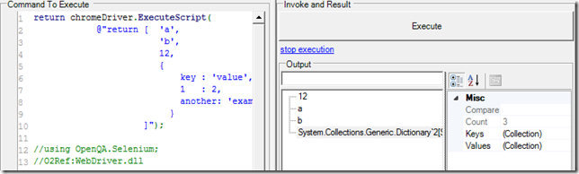
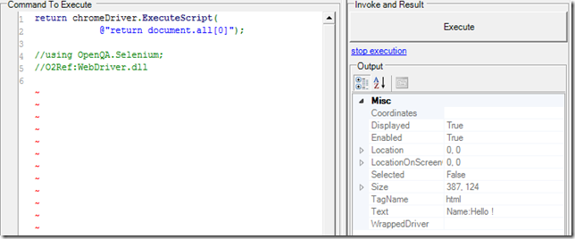
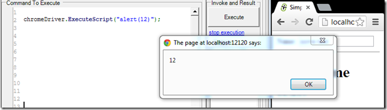
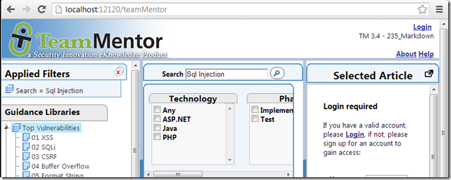

## When the best way to automate Chrome is to use ... Chrome (with examples on Google search, direct AngularJS scope manipulation and ChromeDriver javascript access)

On the topic of Web Automation, I always wanted to have a REPL environment for Chrome like I have for IE ([using Watin](http://o2platform.wordpress.com/category/ie-automation/watin/)).

In the past I have explored multiple solutions, for example the use of CefSharp (see [here](http://blog.diniscruz.com/2012/05/running-chome-inside-o2.html) and [here](http://blog.diniscruz.com/2012/05/video-installing-and-running-cefsharp-c.html)). But that was never the real thing, and there was always a couple issues (caused by the fact that the 'real' chrome wasn't being used).

For a while, in the back on my mind the solution was simple and obvious: **_Use the real Chrome process in a way that it can be programmatically accessed from an O2's C# repl environment!_**

Well, the good news is that is exactly what I have done :)

I just created the Gui you can see below, which uses the [Window-Hikacking](http://blog.diniscruz.com/search/label/WinAPI) technique to inject an (Selenium's ChromeDriver started) Chrome process' window in a Panel, and pass its reference (as a variable) to an O2 REPL environment.

  

The script is called**_ Util - Chrome Browser with REPL.h2_** and it has:  

  * The **cmd.exe** window from the **ChromeDriver.exe** process in the bottom right 
  * The **Chrome** window (started by the ChromeDriver) in the top right 
  * A **C# REPL** (with the CromeDriver object passed in as a parameter) in the left

Now, on the left-hand-side [C# REPL](http://blog.diniscruz.com/p/c-repl-script-environment.html),  I can write a script like this:

Which will:  

  * Open (in Chrome) the [http://www.google.com](http://www.google.com/) web page 
  * Find the 'q' element (the search text input) 
  * Send the Keys 'O2 Platform' to that element 
  * Find the element 'btnG' (the search button) 
  * Click on that element

**Automating an AngularJS page**  
**  
**The next example is more interesting where we are going to open AngularJS page and programmatically change a $scope variable

Lets look at the code to see what is going on.

The first line opens up an the Url with the sample AngularJS example described [here](http://blog.diniscruz.com/2013/06/a-small-angularjs-jasmine-test-executed.html) and [here](http://blog.diniscruz.com/2013/06/adding-karmajs-support-to-webstorm-and.html)

... next I create a number of variables with the url and commands to execute:

... here:

It will probably be easier if I break these commands individually:

And this is all programmed in a nice REPL environment, which makes it really easy to try thing out.

For example, here are a couple interesting two way data exchange between the C# script and the  
Chrome javascript:

**1) get an int value**  

**2) get an string value:**

   

**3) get an simple object (converted into dictionary)**  

   

**4) get an array**  

   

**5) get the document.location object**  

   

**6) get the 'this' object**  

   

**7) get the first document.element **  

   

**8) get the html of the first document.element**  

   

**9) show an alert**  

   

**10) getting and using an Html element via ExecuteScript**  

which will populate the search text value and click on the search icon

What is cool about all these examples is that we are running the code on the local installation of Chrome, ie it is the actually chrome process that we are using, which is great for testing, debugging and developing :)

  
**Scripts used in this post**

**A) C# code that created the GUI (start chromeDriver and chrome processes and hijack they main window)**  

    
    //var topPanel      = panel.clear().add_Panel();   
    var topPanel = "Util - Chrome with REPL".popupWindow(1200,600);

    var replPanel = topPanel.add_GroupBox("C# Repl").add_Panel();  
    var chromePanel = topPanel.insert_Right(replPanel.width() / 2 , "Chrome");  
    var chromeDriver = chromePanel.parent().insert_Below(150,"Chrome WebDriver");

    var firstScript =   
    @"chromeDriver.open(""http://www.google.com"");  
    chromeDriver.FindElement(By.Name(""q""))  
    .SendKeys(""O2 Platform"");  
    chromeDriver.FindElement(By.Name(""btnG""))  
    .Click();  
    return ""done"";

    //using OpenQA.Selenium;  
    //O2Ref:WebDriver.dll  
    //O2File:API_ChromeDriver.cs";

    var chromeHijack = new API_Chrome_Hijack()  
    .open_ChromeDriver();

    chromeHijack.ChromeDriver.script_Me(replPanel).set_Code(firstScript);   
    var hijacked_Chrome = chromePanel.add_Handle_HijackGui(false)   
    .hijackProcessMainWindow(chromeHijack.ChromeProcess);  
    var hijacked_ChromeDriver = chromeDriver.add_Handle_HijackGui(false)   
    .hijackProcessMainWindow(chromeHijack.ChromeDriverProcess);

    //O2File:API_Chrome_Hijack.cs  
    //O2File:API_Win32_Handle_Hijack.cs

    //O2Ref:WebDriver.dll  
      
    **B) first code example (open Google and do a search)**  

        
        chromeDriver.open("http://www.google.com");  
        chromeDriver.FindElement(By.Name("q"))  
                    .SendKeys("O2 Platform");  
        chromeDriver.FindElement(By.Name("btnG"))  
                    .Click();  
        return "done";

    //using OpenQA.Selenium;  
    //O2Ref:WebDriver.dll  
    //O2File:API_ChromeDriver.cs  
      
    **C) 2nd code example, open AngularJS page and programmatically change a $scope variable**  

        
        var url          = "http://localhost:12120/AngularJS/Tests/AngularJS/Simple.html";

    //var jQuery = "http://code.jquery.com/jquery-1.10.1.min.js".GET();  
    var jQuery = "jquery-1.9.1.min.js".local().fileContents();  
    var angular_Cmd1 = "scope = angular.element($('input').eq(0)).scope()";  
    var angular_Cmd2 = "scope.yourName='12345'";  
    var angular_Cmd3 = "scope.$apply()";

    var console_Cmd1 = "console.log('all done, hello should say 12345')";

    chromeDriver.Navigate().GoToUrl(url);

    chromeDriver.ExecuteScript(jQuery);

    chromeDriver.ExecuteScript(angular_Cmd1);  
    chromeDriver.ExecuteScript(angular_Cmd2);  
    chromeDriver.ExecuteScript(angular_Cmd3);

    chromeDriver.ExecuteScript(console_Cmd1);

    return "done";

    // doesn't work to open chrome's inspector  
    // chromeDriver.Keyboard.SendKeys(OpenQA.Selenium.Keys.F12);

    //using OpenQA.Selenium;  
    //O2Ref:WebDriver.dll  
    **D) last example where search filed was retrieved using two different techniques:**  

        
        //open Url  
        /*chromeDriver.ExecuteScript(  
             "document.location= 'http://localhost:12120'"); */

    //Getting the SearchTextBox object via ExecuteScript  
    var searchElement = (RemoteWebElement)chromeDriver.ExecuteScript(  
    "return document.getElementById('SearchTextBox')");  
    searchElement.Clear();  
    searchElement.SendKeys("Sql ");

    //Getting the SearchTextBox object via Selenium selector  
    chromeDriver.FindElement(By.Id("SearchTextBox"))  
    .SendKeys("Injection");

    //Click on search Button  
    chromeDriver.FindElement(By.Id("ctl00_ContentPlaceHolder1_SearchControl1_SearchButton"))  
    .Click();

    return "done";

    //using OpenQA.Selenium.Remote  
    //using OpenQA.Selenium;  
    //O2Ref:WebDriver.dll  

- - - - 
[Table of Contents](../Table_of_contents.md) | [Code](../Code)