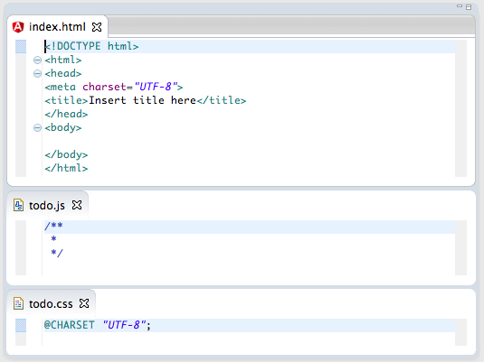
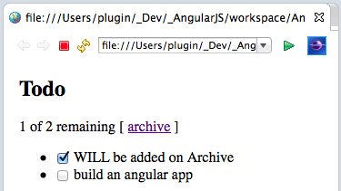
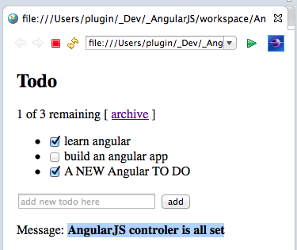
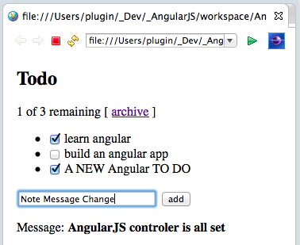
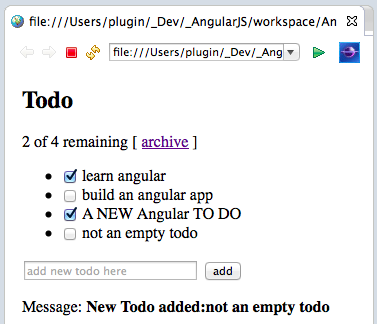

##  Using AngularJS in Eclipse, Part 2) Add Some Control

This  covers the _**Add Some Control**_ example from [AngularJS](http://angularjs.org/http://angularjs.org/)'s home page:  


**1) Creating the Html, CSS and JS Files**  

In order to keep the _AngularJS_Tests_ repository better organized, lets put each sample in its own folder.

After moving the **_The_Basics.html_** file into its own folder, I created a new folder:  


... called _Add Some Control_ to the _WebContent_ folder of the **_AngularJS_Tests_** project


And inside it, I created the **index.html**, **_todo.js_** and **_todo.css_** files (each using the Eclipse default template for the respective file type)


Here is what these 3 files look with the default content:



Here is what they look like with the content from the [AngularJs.org](http://angularjs.org/) **_Add Some Control_** sample:


**2) Opening up in Web Browser**  

To see the example in action, right-click on the **_/Add Some Control/index.html_** file, and chose the **_Web Browser_** option form the **_Open With_** menu


... which will look like this:


The objective of this sample is to add new _Todos_ to the list shown, using the TextBox provided and the **_add_** button


So in the example shown above, after entering _'This is a new ToDo'_ on the TextBox and clicking _add_ a new item will be added to the list (see below)


We can also remove **Todos** by using the checkboxes (see above) and clicking on the _**archive**_ link (see below for the result)


**2) Making some changes to the code to see AngularJS in $scope in action**

To have a better understanding of what is going on, let's make some changes to the code sample.

Here is the original code


... which I'm going to modify by adding a new paragraph containing the value of the **_todoText_** variable (note that the _todoText_ variable is used on the _input_ HTML element, auto-wired to Angular by using the **_ng-model_** attribute).


After refreshing the browser, we can see this in action by typing some text on the TextBox and seeing it show in real time after the '**New Todo text:'** text (one of the features of AngularJS is to keep all these variables in sync):


**3) Changing default Todo(s)**

As another test, let's add a new default _todo_ to the original version of the **$scope.todos** array (see below).

What is happening is that the **_$scope.todos_** variable is populated when the _TodoCtrl_ is executed (part of the page build), which is then inserted into the webpage using the ```<li ng-repeat="todo in todos"\>``` HTML code (see screenshot of index.html above).

Here is the new **_$scope.todos_** array entry added:


... which can be seen in action by refreshing the browser (note that it is already checked by default, since I set the **_done_** variable to **_true_**)


**4) Changing default value of TextBox (after adding new Todo)**  

To show that we can control the **_$scope_** variables from anywhere in the _TodoCtrl_ controller, here is an example where I'm changing the **$scope.todoText** to have a specific value after the **_add_** button is clicked (which is wired to the _$scope.addTodo_ using the **_<form ng-submit="addTodo()">_** HTML code)


After refreshing the web browser, we can see that if we add a new **_todo:_**


...  the TextBox (and paragraph below) will have the value _'Default value'_ (vs the original behavior of being empty)


**4) Creating an 'impossible to archive' Todo**  

An interesting variation is to change the default value of the _$scope.todos_ on the **_$scode.archive_** method, which, instead of being empty:


... it contains one entry:


... which means that (after refresh) and clicking on the **_archive_** link  


... the *WILL be added on Archive* todo will now exist:



... and even if we try to archive all:


... the *WILL be added on Archive* todo will still be there:


**5) Adding a Message label**  

As a final example, lets modify change the variable shown in the extra paragraph added to index.html to be _message_ (which will be wired to **_$scope.message_**):


... and lets use that variable to provide visual feedback to the user when the _TodoCtrl_ has executed:


Now, we should see the message *'AngularJS controller is all set'* just after the page finishes reloading:



To make it more relevant, lets add a _$scope.message_ to the _$scope.addTodo_ method:


... and the _$scope.archive_ method:


Now we will get this message when the page reloads:



... this message after clicking on the **_add_** button


... this message after clicking on the **_archive link_**


Finally let's refactor the _$scope.addTodo_ method to so that it doesn't add a new **_Todo_** when no value is provided:


After reloading the page, we can confirm that trying to click on the **_add_** button without entering first any text on the TextBox will show this message:


... and if we add a new one (in this case _'not an empty todo'_) we will see this message:


