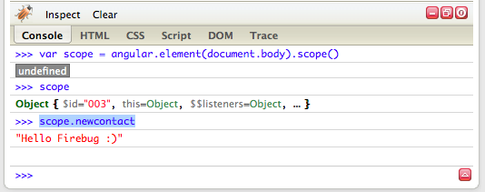

##  Programmatically changing an AngularJS scope variable and adding Firebug Lite to an AngularJs app

In this post I'm going to show two really nice tricks that help when developing AngularJS applications:  

  * adding [Firebug Lite](https://getfirebug.com/firebuglite) to the current browser
  * changing the scope value outside a normal AngularJS controller, service or module

Let's say that we are inside Eclipse and have this simple AngularJS app ([gist here](https://gist.github.com/DinisCruz-Dev/9295707))  

... which looks like this when executed:

To add Firebug Lite to this page, all we need to do is to add a script reference to **_https://getfirebug.com/firebug-lite-debug.js_**

... and after refresh we will have a nice Firebug Lite console (and other nice goodies) at the bottom of our page :)

Next lets see how to access and change the AngularJS **_$scope_** of the _**ContactController**._  

The objective is to access programmatically the **_New Contact_** value (set below to _**Hello Firebug :)**_ )

In Firebug Lite, we can access the scope object by executing: **_var scope = angular.element(document.body).scope()_**

... and the **New Contact **value value using: **_scope.newcontact_**

If we change the **_New Contact_** value here (in Firebug Lite) using **_scope.newcontact = "Hello AngularJS"_**

... we will notice that the value will not automagically (ala AngularJS way) change in the binded (via **_ng-model_**) input field

The reason that didn't happen is because the change was done outside the AngularJS $digest cycle.

The solution is to call the **_scope.$apply()_** function (and the input field will be updated):

