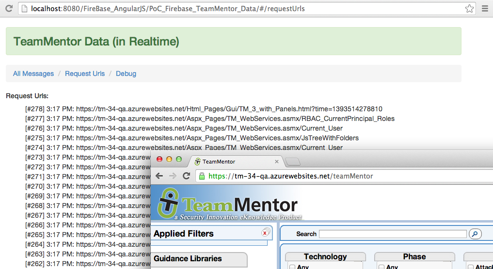
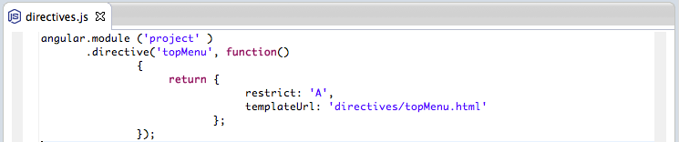

## Really SIMPLE and clean AngularJS + Firebase example

As seen on the [First PoC of sending TeamMentor's server-side request URLS to Firebase (and seeing it in realtime in an AngularJS page)](C3_Firebase-firstpocofsendingteammentorsserversiderequesturlstofirebaseandseeingitinrealtimeinanangularjspage.md) I created a *Simple* AngularJS website which I'm very happy with (and I mean *Simple* with a capital *S*).

The main reason I really like the solution shown below, is because it represents a number of really nice, clean and *Simple* solutions for common (complex) problems that exist while developing in Javascript.

The created application is an:  

  * AngularJS real-time viewer for HTTP requests,
  * ... made to an ASP.NET web application ([TeamMentor](https://teammentor.net/)),  
  * ... captured by an custom [C# HttpHandler filter](http://blog.diniscruz.com/2014/02/first-poc-of-sending-teammentors-server.html),
  * ... submitted to [Firebase](https://www.firebase.com/) using its REST API and
  * ... pushed back to the AngularJS app using open HTML 5 WebSockets.

The image below shows what the AngularJS+Firebase application looks like, with the urls shown in the background browser being the ones requested when the TeamMentor website is loaded or navigated (note that the latency between _'request made'_ and _'request listed'_ is really small (about ~ 50 milliseconds)):



What I also like about the AngularJS structure that I ended up with, is that it represents a great way to learn AngularJS' architecture and capabilities (and yes I know and agree that for bigger AngularJS apps it is better to [organize by feature](http://organizate%20by%20feature%20tech.pro/tutorial/1699/building-large-apps-with-angularjs) and group the multiple files under a dedicated folder (for example the login controller, service, factory, view and tests should all go under the same logical folder))

This post contains a tour of the multiple files created ([gist here](https://gist.github.com/DinisCruz-Dev/9254258)) which where developed/refactored while in Eclipse using the [Eclipse Groovy REPL script to sync a Browser with file changes (with recursive folder search via Java's WatchService)](http://blog.diniscruz.com/2014/02/eclipse-groovy-repl-script-to-sync.html)

**Folder/File Structure:**

Inside an Eclipse Web Static project, I created a file structure with:

  * _index.html _as the main AngularJS file (i.e. this is **_the_** single-page application file)
  * all javascript files were placed in the **_js _**folder (with the file names providing a clue on what they are doing/providing)
  * 1 directive created in the **_directives_** folder
  * 3 views placed on the **_views_** folder


**1) Index.html**

This is the file loaded directly by the browser, which is made of:  

  * External/Framework javascript includes: _angular.js, angular-route.js, firebase.js, angularfire.js, bootsrap.min.css_
  * AngularJS javascript includes (for the current application): _app.js, factories.js, controllers.js, directives.js, routes.js_
  * CSS link to _bootstrap.min.css_
  * Html body (containing the AngularJS **_ng-app _** directive) and:

    * div tag with _**container**_ css class
    * h3 tag with **_alert-success_** css class (which creates that nice green top banner)
    * the custom **_top-menu_** directive (using _attribute_ instead of _element_)
    * the AngularJS **_ng-view_** directive   


Since I'm using the [AngularJS Eclipse ](https://github.com/angelozerr/angularjs-eclipse)plugin, hovering the mouse op top of an AngularJS directive provides a nice description of they do.

Here is the _ng-app_ directive  


... and here is the **_ng-view_** directive:


**2) app.js**

This is where the **_project_** module is created (with two dependencies **_ngRoute_** and **_firebase_**).

Since I moved the controllers, factories, directives and routes into their own separate js file, there wasn't much to do here, apart from creating global values for the firebase URL and auth token (which will be dependency injected into the controllers and factories)


**3) controllers.js**

This file contains 3 controllers: **_DebugCtrl_**, **_MessagesCtrl_** and _RequestsUrlCtrl_ (each will be used on a specific view)

Note that each controller has services injected into them (the AngularJS **_$scope_** and the custom **_fbDebugMsg_**, **_fbRequestUrl_**, **_fbaDebugUrl_**)

The _DebugCtrl _is currently just adding the injected _fbDebugMsg_ and **fbRequestUrl** services into the _$scope_ so that we can see them in the view (this is a nice trick to get an inside view of AngularJS objects)

The _MessagesCtrl_ is using the Firebase [AngularFire API](https://www.firebase.com/docs/angular/reference.html), which is makes it really easy to create the firebase-real-time update view (my only problem with this was that there didn't seem to be an easy way to re-order the new elements (which in the current AngularFire implementation are added at the end of the provided array)

The _RequestsUrlsCtrl_ uses the default Firebase [Javascript API](https://www.firebase.com/docs/javascript/firebase/index.html) (i.e not the AngularFire one) which gives us more control on how to handle the data received by Firebase. The **_$scope.urls_** array is used to store the data received from the Firebase **_child_added_** event (one note here to say that the  Firebase _child_added_ will also provide the entire data-set on first load, which is okish, but I would prefer that the _child_added_ only fired for new events)


**4) directives.js**

This is a simple directive used by **index.html**, that will display a top menu, created by the content of the **_topMenu.html_** file (directives are AngularJS way to creating/defining new HTML tags/attributes)




**5) factories.js**

These factories create the Firebase mappings, namely they define the 'area' (or namespace/object) that the data will be read from.

The first two (**_fbDebugMsg_** and **_fbRequestUrl_**) use the Firebase [Javascript API](https://www.firebase.com/docs/javascript/firebase/index.html). I needed to do them this way so that I could add the Firebase auth token (that said, I'm sure there is a better way to do this in Angular, since ideally I would have an Angular service that took the two variables that need to be set: the target Firebase area and auth code)

The _fbaDebugMsg_ is just a simple service/factory to return an [AngularFire API](https://www.firebase.com/docs/angular/reference.html) object based on the (dependency injected) **_fbDebugMsg_** service


**6) routes.js**

The routes configuration is basically defining the 3 available views (each with a different controller mapped to it)


**7) requestUrls.html** (view)

Since the _RequestsUrlsCtrl_ is responsible for updating the **$scope.urls** array, all we need to do here is to use Angular's _ng-repeat_ directive to create a list with all items (the _list-unstyled_ class hides the bullet usually shown in HTML ```<li>``` tags).

Note that since the _RequestsUrlsCtrl_ controller is using the Firebase [Javascript API](https://www.firebase.com/docs/javascript/firebase/index.html) **child_added** event, we will see new entries shown in real time (ie. no browser refresh needed), but any changes made to existing items will not be reflected on the UI (unless the entire page is refreshed and the data is reloaded)


**8) messages.html** (view)

In this view the **_$scope.messages_** (used in the **_ng-repeat_**) is populated by the **MessagesCtrl** controller which is using the [AngularFire API](https://www.firebase.com/docs/angular/reference.html). This means that data will be updated in real time (on both add and change events)


... which look like this:


**9) debug.html** (view)

This view just shows a json representation of the _fbDebugMsg_ and **_fbRequestUrl_**


... which looks like this:


**10) topMenu.html** (directive templateUrl)

Finally this is the html that creates the top menu (this could be improved/refactored by having the url and titles being provided as a **_ng-model_** object)


**All code:**

For reference here is the entire source code ([gist here](https://gist.github.com/DinisCruz-Dev/9254258)) of the source code files shown above.
