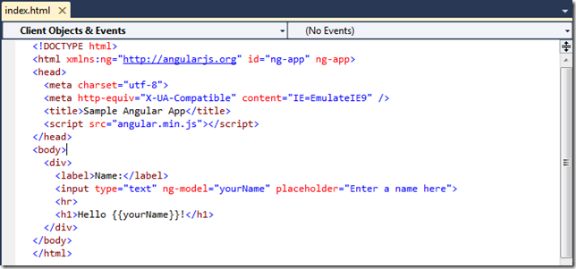
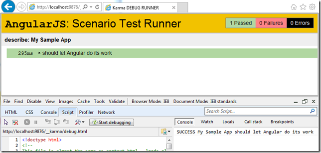
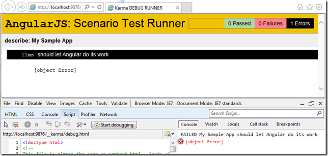

## KarmaJS AngularJS Scenario Test Runner execution variations in IE 7,8,9 and 10 when using AngularJS

While trying to get [Karma JS](http://blog.diniscruz.com/2013/06/running-karmas-angularjs-example.html) to work, I found a number of different behaviors for its AngularJS Scenario Test Runner in IE's multiple _'compatibility modes'._

TLDR: some of the Jasmine and AngularJS test apis don't work (although Angular does seem to work ok)

Here is the default web page I was using:  

Here is the test executed

Here is KarmaJS starting and successfully executing the tests

... in this captured IE browser session:

Just to confirm that the target page works in the multiple IE configurations, here it is running in:

IE 10 , IE9, IE 8:

... and even in IE 7:

Now lets click on the _DEBUG _button to open the KarmaJS's**_ AngularJS Scenario Test Runner_** view and see what happens in multiple IE compatibility modes.

**IE 10 Works:**  

   

**IE 10 Compatibility View**  

**IE 9 Fails:**  

**IE 8 Works (WTF!!)**  

   

**IE 7 Fails** 

So unfortunately it looks like this technique can't be used to run e2e (end-to-end) tests on AngularJS apps using KarmaJS
